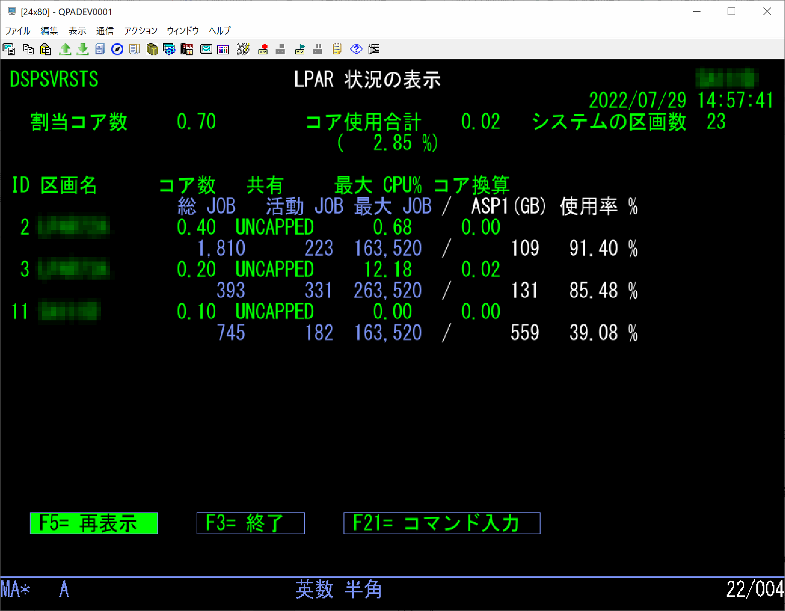
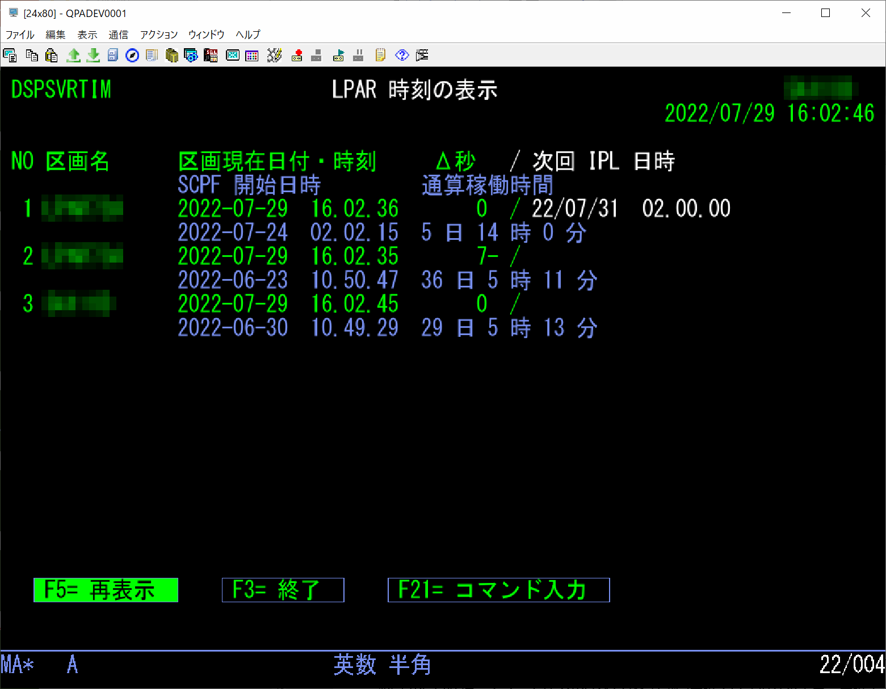
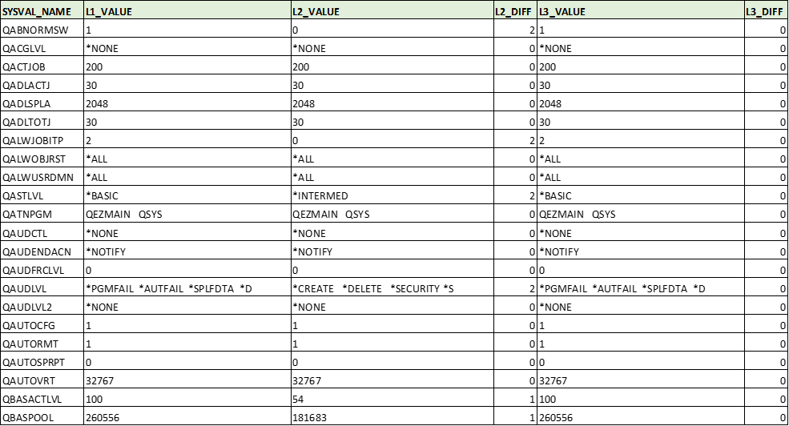

  

# 複数区画/サーバー集中管理

このサンプルでは複数区画/サーバーに分散したIBM i の情報をSQLで一括して取得し、表示または印刷する。

管理対象のIBM i区画/サーバーはDRDA※で接続されており、情報の取得には「IBM i サービス(SQL)」を利用している。

- IBM i サービスの概要は、動画[「IBM i サービス (SQL) 概説編」](https://youtu.be/x2hKUbiJxYo)を参照
- サンプルについては動画「ライト・モダナイゼーション 標準ソフトウェア編」の[「3-3.IBM i サービス(SQL)」](https://youtu.be/vl2u_TjttFg?t=1285)を参照

 

「IBM i サービス」を利用すれば、比較的容易にユーザー・プロフィールやプログラム、ファイルなどのオブジェクト状況、システム値など各種設定、PTF適用状況などで取得可能な様々な情報を収集できる。本番以外に待機機・災対機・検証区画・ステージング区画などの複数のIBM i を利用しているケースで、環境の運用・管理や、整合性の調査・維持を効率かつ確実に行える。

| 機能(取得情報) | SQLタイプ | IBM i サービス |
---------------|--------|-----------------------------------------| 
| 現行区画に関する詳細 | ビュー | [QSYS2.SYSTEM_STATUS_INFO](https://www.ibm.com/docs/ja/i/7.4?topic=services-system-status-info-view) |
| システム値についての情報 | ビュー | [QSYS2.SYSTEM_VALUE_INFO](https://www.ibm.com/docs/ja/i/7.4?topic=services-system-value-info-view) |
| ジョブ情報 | テーブル関数 | [QSYS2.JOB_INFO](https://www.ibm.com/docs/ja/i/7.4?topic=services-job-info-table-function) |

##### ※ DRDA/DDM(分散関係データベース体系)は業界団体である「The Open Group」が公開している、異なるプラットフォーム上のアプリケーションとデータベース・システム間の通信を可能にするオープンなアーキテクチャ 

***

## 一括稼働状況表示

複数サーバー/区画のシステム状況を1画面に集約して表示。

表示項目は各サーバー/区画のCPUやASPの使用率、ジョブ数など。  
日常の運用での利用に加え、中期的なサーバー全体のCPU/Disk割り当て最適化を大まかに把握できる。

### 【使用ファイル】  

| MBR/OBJ/FILE名 | タイプ | テキスト/補足 |
---------------|--------|-----------------------------------------| 
| DSPSVRSTSD | DSPF | 区画稼働状況表示 DSPF |
| DSPSVRSTSR | SQLRPGLE | 区画稼働状況表示 SQLRPGLE |

### 【コンパイルおよび環境設定】

「[INSTALL.md](INSTALL.md)」を参照。

### 【実行】

プログラムDSPSVRSTSRをCALLで実行。

**表示項目**
- 見出し情報
  - 対象区画の割り当てコア数合計、照会時点で使用されているコア数、システムの総区画数
- 区画毎の情報
  - 1行目：区画の名前、割り当てコア数、CPU共有方式、最大CPU使用率、CPU使用率をコア数換算した数値
  - 2行目：総ジョブ数、活動ジョブ数、最大ジョブ数、ASP1の容量、ASP1の容量使用率

***

## 一括動作時刻表示

複数のサーバー/区画の時刻に関する情報を一括表示。

表示項目は各サーバー/区画の現在日時、基礎となる区画との時刻差異、次回IPL日時など。  
外部との連携処理やシステム間同期などを行っているケースで、時刻のずれが許容範囲かを容易に確認可能。

### 【使用ファイル】  

| MBR/OBJ/FILE名 | タイプ | テキスト/補足 |
---------------|--------|-----------------------------------------| 
| DSPSVRTIMD | DSPF | 区画動作時刻表示 DSPF |
| DSPSVRTIMR | SQLRPGLE | 区画動作時刻表示 SQLRPGLE |

### 【コンパイルおよび環境設定】

「[INSTALL.md](INSTALL.md)」を参照。

### 【実行】

プログラムDSPSVRTIMRをCALLで実行。

**表示項目**
- 明細行(区画毎の情報)
  - 1行目：各区画の名前、区画の現在日時、基礎となる区画との時刻差異(Λ秒)、次回IPL日時
  - 2行目：SCPFジョブの開始時刻、連続稼働時間

- 次回IPL日時は、システム値QIPLDATTIMが設定されている場合のみ表示
- 区画が開始された正確な日時を取得する事はできない。最初に起動するシステム・ジョブであるSCPF(Start Control Program Function)ジョブの開始時刻の1～3分前が起動時点と推定される  
参考：[「When was the last IPL performed?」](https://www.rpgpgm.com/2022/01/when-was-last-ipl-performed.html)

***

## 区画間システム値比較

ベースとなる区画と他のサーバー/区画のシステム値との差異を印刷出力。

差異のあるシステム値を調べ、初期構築時の設定確認や運用時における定期的な区画間整合性チェックを容易かつ確実に実施可能。

### 【使用ファイル】  

| MBR/OBJ/FILE名 | タイプ | テキスト/補足 |
---------------|--------|-----------------------------------------| 
| CMPPARTVAL | CLP | 区画間システム値比較 |

### 【コンパイルおよび環境設定】

「[INSTALL.md](INSTALL.md)」を参照。

### 【実行】

CLプログラムCMPPARTVALを実行。  
結果はワークファイルからQueryで印刷出力される。

**出力イメージ**

- 例では3つの区画(比較元[L1]、比較先その1[L2]、比較先その2[L3])を比較
- 「L?\_VALUE」はその区画のシステム値の設定値をそのままリスト
- 「L?\_DIFF」はベース区画(例ではL1)との差異を、差異無しは「0」、数値項目の差異ありは「1」、文字項目の差異ありは「2」で出力

