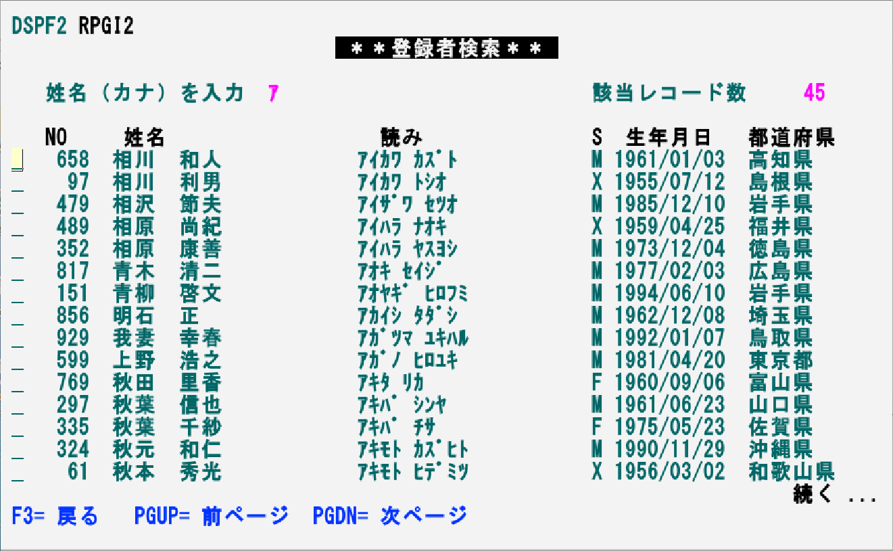
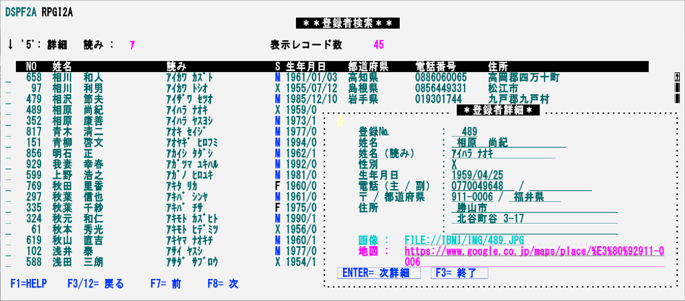
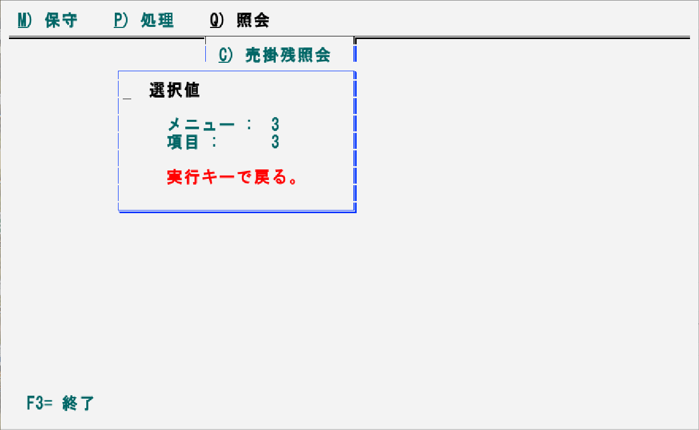
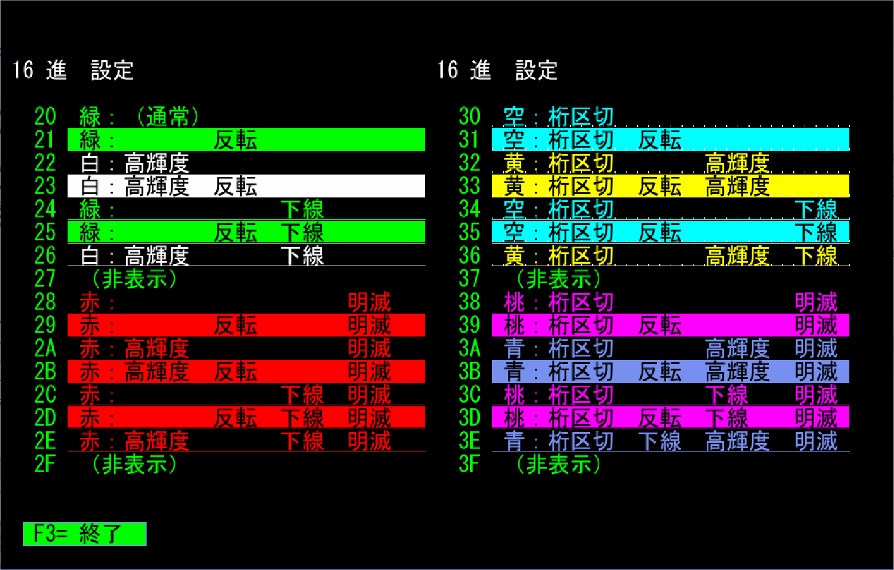

# 5250画面の活用

DDSによる文字ベースのGUIや画面罫線などを活用し、5250画面の使い勝手を向上させる例。  
概要は動画「ライト・モダナイゼーション 5250編」の[「2-1. 5250モダナイゼーション」](https://youtu.be/UK7bUT30XRs?t=255)を参照

伝統的な5250画面プログラムのモダナイズには、再構築、Web化、API化などいくつかの手法があるが、ここではDDSと5250エミュレーター(ACS)の標準機能のみで可能な拡張を実施。

サンプルのインストール手順は[INSTALL.md](INSTALL.md)を参照。   

***

## 照会画面（非モダナイズ版）作成・実行例

モダナイズ対象として、典型的と思われる「既存の」5250照会アプリケーション(非モダナイズ版)の例。  

### 【使用ファイル】  

| MBR/OBJ/FILE名 | タイプ | テキスト/補足 |
---------------|--------|-----------------------------------------| 
| DSPF2 | DSPF |        登録者照会２                  DSPF |
| RPGI2 | RPG | 登録者照会２                  RPG/400 |

### 【コンパイル】  

それぞれ、CRTDSPF、CRTRPGPGMコマンドでコンパイル。 

### 【画面例】

名前の先頭部分を半角カタカナで入力し、これに一致したデータを表示。明細の左端に「5」を入力して実行すると明細を表示。

---

## 照会画面（モダナイズ版）作成・実行例

下記の機能を拡張したモダナイズ版の照会アプリケーション。

- GUI機能の動作：プルダウンリスト、画面罫線、スクロールバー、DDSウインドゥ、ヘルプ機能
- マウスによる操作：マウスの左ボタンダブルクリックで実行、有効エリア外を左ダブルクリックで前画面、プッシュボタンの左シングルクリックで機能キーの実行、マウスホイールでサブファイルのスクロール
- キー操作：従来画面でのすべてのキー操作がGUI画面でも可能。加えてサブファイルの明細行にカーソルを位置付けて実行キーで明細表示、タブキーによるプッシュボタンなどのGUI部品間の移動、有効エリア外にカーソルを位置して実行で前画面

### 【使用ファイル】  

RPGI2ALEでは。物理ファイルPERSONのデータが5026で登録されているため、プログラム内で5026(CP290)の英小文字をURL文字列などに使用。  
CP290の英小文字は日本以外とは異なるコードポイントを持つ独自の英小文字のため、例えばILE-RPGでは英小文字と認識されない。  
ソースファイルのCCSIDを5026とし、ホスト・コード・ページ1399の5250セッションからサインオンしてCHGJOB CCSID(65535)を実行した後にSEUでメンバーを開き、入力しているが、操作が煩雑なため非推奨。

| MBR/OBJ/FILE名 | タイプ | テキスト/補足 |
---------------|--------|-----------------------------------------| 
| DSPF2A | DSPF | 登録者照会２（モダナイズ版）  DSPF |
| RPGI2A | RPG | 登録者照会２（モダナイズ版）  RPG/400 |
| RPGI2ALE | RPGLE | 登録者照会２（モダナイズ版）  ILE-RPG |

### 【コンパイル】  

それぞれ、CRTDSPF、CRTRPGPGM、CRTBNDRPGコマンドでコンパイル。 

### 【環境設定】  

IBM i の/IMGディレクトリーに物理ファイルPERSONの登録番号に対応した画像ファイルを配置。
このディレクトリーをNetServer共有でPCからアクセス可能に設定。

### 【画面例】

モダナイズ版の照会アプリケーションを実行し、非モダナイズ版と操作性を比較。
マウスのみで快適に操作できると同時に、キーボードからも複数の方法で効率よく操作ができる事を確認。

- 検索条件(カナ苗字)の入力
  - 非GUIプログラム同様に、入力フィールドに検索文字を入力して実行
  - プルダウンリストを使用
    - プルダウンリストを表示
      - ＋を左クリック / F4キーを押す / 画面下部「F4= リスト」を左クリック / タブキーで＋にカーソルを合わせて実行
    - プルダウンリストをスクロール
      - 前ページ、次ページキー / F7、F8キー / マウスホイール / スクロールバーをクリック
    - プルダウンリスト項目の選択と検索の実行
      - リスト項目(例えば「ア」)の左ダブルクリック / 項目にカーソルを合わせて実行キー
    ― プルダウンリストを閉じる
      - F3キー / 「取消」を左クリック / 「取消」にカーソルを合わせて実行
 
- 明細画面
  - 明細をスクロール
    - 前ページ、次ページキー / F7、F8キー / マウスホイール / スクロールバーをクリック / 「F7=前」「F8=次」ボタンを左クリック
  - ヘルプウインドゥを表示
    - F1キー / 「F1=HELP」にカーソルを合わせて実行 / 「F1=HELP」を左クリック
  - 明細ウインドゥを表示
    - 明細左に「5」(複数可)を入力して実行 / 明細にカーソルを合わせて実行 / 明細を左ダブルクリック
  - 明細行の拡張(80桁表示時のみ有効)
    - F6キー / 「F6=行±」にカーソルを合わせて実行 / 「F6=行±」を左クリック
  - 前画面に戻る/終了
    - 画面下の「戻る」「終了」ボタン記載のキーを押す / 画面下の「戻る」「終了」ボタンにカーソルを合わせて実行 / 画面下の「戻る」「終了」ボタンを左クリック / 機能を持たない画面領域を左ダブルクリック、またはカーソルを合わせて実行

- 明細ウインドゥ
  - 明細画面と同様 

※「次ページまたは前ページがファイルの最初または最後のレコードを超えた。」と表示された場合は機能キーを押すか、このメッセージが表示されている行を左クリック

明細ウインドゥのホットスポットをクリックするとURLに対応したアクションを実行。

- 「画像」のURIをクリックするとWindowsで拡張子「.jpg」に関連付けられたアプリケーションで画像が開く
-	「地図」のURIをクリックすると「郵便番号」の位置の地図がGoogle MapでWebブラウザに表示

  

### 【その他】

このアプリケーションは5250エミュレーターの画面サイズ設定を自動判別し、エミュレーターの設定に合わせたサイズの画面で動作する。IBM iからサインオフし、ACSの設定を「27x132」⇔「24x80」で切り替え、再度IBM iに接続→サインオンし、同じアプリケーションが広い/狭い画面で同様に動作する事を確認。

多数の5250クライアントを一斉に27x132に統一できない、あるいは、何らかの理由で24x80のみを使用する必要がある場合に両画面対応が望まれるが、コーディング量が多くなりアプリケーション保守のワークロードが増えるため、いずれかに統一する事を推奨。

---

## メニュー・バーの例 作成・実行例

DDSでテキストベースのメニューバーを定義・利用するサンプル。上部に表示されたメニューバーを、マウス、機能キー、ショートカット文字のいずれかでメニュー項目を選択・実行。

### 【使用ファイル】  

| MBR/OBJ/FILE名 | タイプ | テキスト/補足 |
---------------|--------|-----------------------------------------| 
| MNUDDS |  DSPF  | 5250プルダウンメニューDSP |
| MNURPG | RPG  |  5250プルダウンメニューRPG/400 |

### 【コンパイル】  

それぞれ、CRTDSPF、CRTRPGPGMコマンドでコンパイル。 

### 【画面例】

操作方法を下記に示す。

-	マウス
  - 選択項目をクリック
- 機能キー
  - カーソルキーまたはタブキーで横方向項目(「M) 保守」→「P) 処理」→「Q) 照会」)を移動してEnterでプルダウンを表示
  - カーソルキーでプルダウンの縦方向項目(「I) 請求」→「C) 売上」→「S) 決算」→「M) 月次」)を移動
  - Enterキーで項目を選択
  - プルダウン表示時にF12キーを押すと横方向項目の選択に戻る
  - ショートカット文字
  - キーボードでショートカット文字を押して選択

項目を選択するとウインドゥが表示されるので、マウスの左ダブルクリックかEnterキーで横方向項目の選択に復帰。

---

## 5250表示属性一覧 作成・実行例

DBCS(漢字)端末上で利用できる文字の色と属性。

文字の色・属性に意味を持たせて、通常表示・強調表示・警告・エラーなどに特定の色を割り当てれば、UIの標準化が可能。

### 【使用ファイル】  

| MBR/OBJ/FILE名 | タイプ | テキスト/補足 |
---------------|--------|-----------------------------------------| 
| DSPFATR |  DSPF  | DSPATRの組合せ|
| DSPFATRC |  CLP  | DSPATRの組合せ-表示用CLP |

### 【コンパイル】  

CRTDSPF、CRTCLPGMコマンドでコンパイル。 

### 【画面例】

- 表示属性には、明滅、桁区切り線、高輝度、非表示、反転、下線などがあり、文字色は、緑、白、赤、空色、黄色、ピンク、青。
- エミュレーターと設定にもよるが、空色と黄色では桁区切りが表示される。ACSのデフォルトでは桁区切り線は「点」(ドット)で表示され、「線」(「列分離子」に「行」を指定)に設定を変更可能。
- 明滅させられる文字色は赤のみ。ACSでは「編集」→「設定」→「外観」→「表示...」で「明滅テキストの表示」に「明滅テキスト」を指定した場合にのみ、赤の一部(16進の「2A」、「2B」、「2E」)が明滅。

