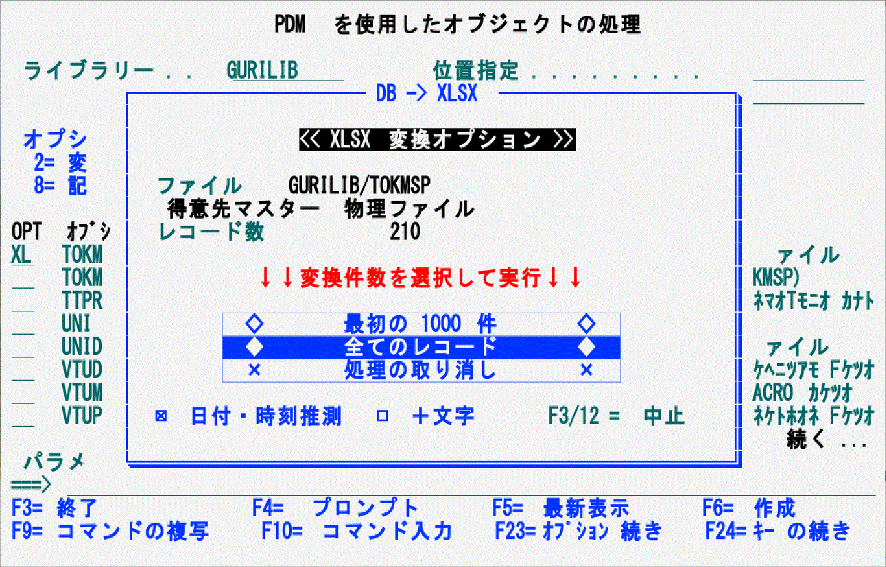
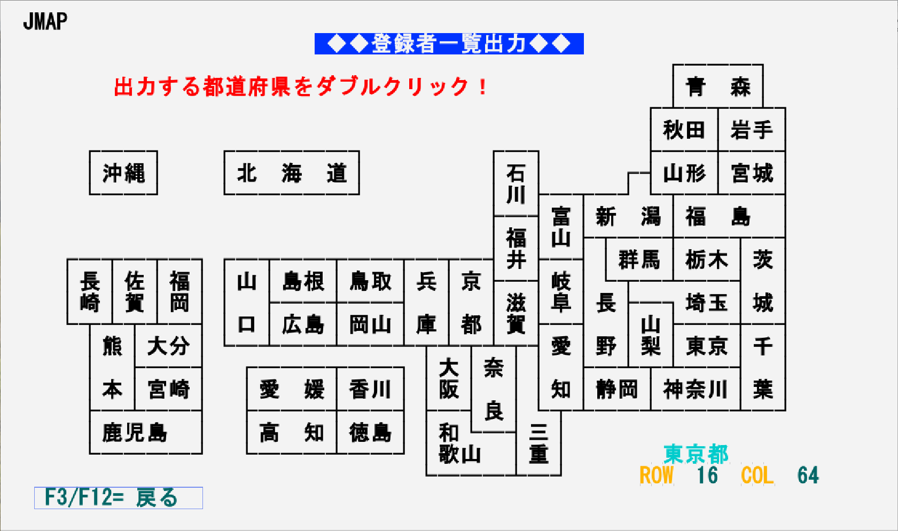

# ワンアクション連携

5250画面を起点とし、ワンアクションでIBM i の情報をTEXT/Excel/PDF形式でPCに表示。

ここで「ワンアクション」は下記の操作を指す。

- オプションを入力して実行
- 5250画面をマウスでダブルクリック

これらサンプルプログラムは従来の5250業務との連続性を考慮して5250画面を起点としている。
同じテクニックを利用し、次のような展開が可能と思われる。  
※ クライアントのExcel(VBA)を利用する「Db2 for i (物理ファイル) ⇒ Excel変換＆表示」を除く。

- Webアプリケーション、あるいは、Web APIとして実装
- 定型的な処理であれば夜間バッチなどで自動作成し、メール、共用フォルダーなどで共有。(ノーアクション連携)

なお、いずれも ***ワークディレクトリーに作成した中間ファイルなどが蓄積する(上書き/消去をしない)*** ので、別途、定期的にクリーンアップ(削除)する仕組みを考慮。

---

各プログラムのインストール方法は[INSTALL.md](INSTALL.md)を参照。

***
## Db2 for i (物理ファイル) ⇒ Excel変換＆表示

PDMのオプショで物理ファイルをExcel化してPCに表示。 ([得意先マスターのExcel化サンプル](得意先マスターのExcel化サンプル.xlsx)) 

IBM i のデータをExcelに変換するには、エミュレーターのデータ転送を使ったり、IBM i側でCSVに変換したファイルをPCにダウンロードしてExcelで読み込んだりと、相応の手順を要する。。Excelに転送した後も、文字が数値になったり 、列幅を調整したりと、何らかの手直しが必要になる部分も多い。

このサンプルはExcel生成時にVBAで下記の処理を行い、後処理の手間を削減している。
- オートフィルター付きのテーブルとなり、1行目にCOLHDG(欄見出し)が表示される
- 最小限の整形がなされており、数値はカンマ区切りで表示、日付は数値ではなく日付で表示、列幅がある程度調整される
- 追加の「フィールド記述」シートにデータベース・ファイルのフィールド情報が記録されており、データベース構造を知る事が可能

概要は動画「ライト・モダナイゼーション 5250編 」の[「2-2. ワンアクション連携」「データのExcel化」](https://youtu.be/UK7bUT30XRs?t=1648))を参照

### 【使用ファイル】  

| MBR/OBJ/FILE名 | タイプ | テキスト/補足 |
---------------|--------|-----------------------------------------| 
| DB2CSVPDM | CMD |        DB2CSV frontend for LMTCPB(\*YES) users |
| DB2CSVD   |  DSPF  |      物理ファイルのDATA/FFDをCSV変換- DSPF |
| DB2CSV    |  CLLE  |      物理ファイルのDATA/FFDをCSV変換 |
| DB2EXCEL.XLSM | STMF |      Windows PCのデスクトップに配置 |
| DB2EXCEL.CMD  | STMF |      Windows PCのデスクトップに配置 |
| /TMP/EMUTOOL/ | DIR | 作業ディレクトリー |

### 【コンパイル】  

ソースタイプに合わせてCRTDSPF、CRTBNDCL、CRTCMDコマンドで作成。

### 【環境設定】  

下記作業を実施。

- STRPDM → 「F16=ユーザー・オプション」でExcel変換用のオプション「XL」と「XF」を追加  
- ワークディレクトリーの作成とNetServer共有の追加
- ファイル「DB2EXCEL.xlsm」「DB2EXCEL.cmd」をデスクトップに配置

Windows版Excel 2016で動作を確認。他のバージョンの動作は不明。

### 【実行】

PDMで物理ファイルに対して「XL」(NetServer利用)または「XF」(FTP利用)をオプションに指定。

- 大量のレコードの対話型変換が全体パーフォーマンスに影響しないように、「<< XLSX変換オプション>>」ウインドゥが表示される。
- 変換対象物理ファイルのレコード数が1000件以上の場合は「最初の1000件」が、1000件未満の場合は「全てのレコード」にカーソル(反転部分)がセットされる。
- カーソルキーで選択して実行、または変換件数選択をマウスでダブルクリックして実行  
  
 

ネットワークからダウンロードしたExcelを開くと「保護ビュー」となる場合がある。  

デスクトップに配置した DB2EXCEL.XLSM を開いて「実行時エラー」のダイアログに「終了(E)」で答え、Excelを上書き保管すれば次回からは「保護ビュー」と表示されなくなる。

***
## スプールファイル ⇒ TEXT/PDF変換＆表示

WRKSPLF、WRKOUTQなどのスプール一覧からオプション「P」でPDF、「T」でテキストにスプールを変換し、PCに表示。([WRKACTJOBのPDF化サンプル](WRKACTJOBのPDF化サンプル.PDF))   
変換対象はSCSのスプールファイルで、AFPDSやUSERASCIIは対象外。

概要は動画「ライト・モダナイゼーション 5250編 」の[「2-2. ワンアクション連携」「スプールのText/PDF化」](https://youtu.be/UK7bUT30XRs?t=1464)を参照。 

### 【使用ファイル】  

| MBR/OBJ/FILE名 | タイプ | テキスト/補足 |
---------------|--------|-----------------------------------------| 
| SPL2PCD | CLLE | ユーザー定義リストアクション(SPLF->PC文書)  |
| SHIFT | RPGLE | Pad blank to every shift code to align DBCS string |
| /TMP/EMUTOOL/ | DIR | 作業ディレクトリー |

### 【コンパイル】  

ソースタイプに合わせてCRTBNDCL、CRTBNDRPGコマンドで作成。

### 【環境設定】  

下記作業を実施。

- ワークディレクトリーの作成とNetServer共有の追加
- 出口点「ﾕｰｻﾞｰ定義のｽﾌﾟｰﾙ･ﾌｧｲﾙ･ﾘｽﾄ」(QIBM_QSP_SPLF_LSTACT)に出口プログラムを登録

### 【実行】

WRKSPLF、WRKJOB OPTION(*SPLF)、WRKOUTQ (OUTQ名)など、システム提供スプール一覧画面でオプションに「T」または「P」を指定。

- NetServer共有へのアクセスのタイミング(?)によっては生成されたテキスト/PDFへのアクセスが不定期に「ネットワーク・エラー」になるケースあり。
再試行すれば正常にファイルが表示されることがほとんど。
確実な動作が要件となる場合、NetServer共有以外(FTP転送など)の利用を推奨
- IBM i 7.5ではQCCSIDが65535に設定されているとPDF生成がエラーになる障害あり。(2022/10/14時点で未解決)

***
## 高品質な帳票生成とPDF化

RPGで画像・QRコード・罫線・アウトラインフォントを含む、高品質帳票([出力例](AFPPRTF_サンプル出力.pdf))を生成してPDFでPCに表示。  
githubでPDF全体が表示されない場合は、ローカルにダウンロードしてAdobe Readerで開く。

概要は動画「IBM i 装飾印刷とPDF化」の[「3. AFPで高機能印刷」](https://youtu.be/ukN8UVLe0mw?t=633)を参照

### 【使用ファイル】  

| MBR/OBJ/FILE名 | タイプ | テキスト/補足 |
---------------|--------|-----------------------------------------| 
| JMAP | DSPF | ＡＡ（アスキーアート）による日本地図画面 |
| JMAPC | CLLE | 日本地図の都道府県から印刷出力を生成 |
| AFPPRTF | PRTF | AFPを利用した帳票（印刷装置ファイル） |
| AFPPRT | RPGLE | AFPを利用した帳票（印刷プログラム） |
| /TMP/EMUTOOL/ | DIR | 作業ディレクトリー |

### 【コンパイル】  

CRTDSPF、CRTBNDCL、CRTPRTF、CRTBNDRPGコマンドでコンパイル。

印刷装置ファイルAFPPRTF作成時はソース内のパラメーターを参考にし、必要であれば出力サイズや用紙を調整。

### 【環境設定】  

ワークディレクトリーの作成、NetServer共有を設定。

### 【実行】

オブジェクトライブラリーをライブラリーリストに載せて、CLプログラムJMAPを実行。  
任意の都道府県を左ダブルクリックすると指定した都道府県のデータがPDFでPCのデスクトップに表示される。

- QRコードには住所データが記録されているので、実際にスマートフォンなどでバーコードを読み取り可能 ([PDF出力の例](AFPPRTF_サンプル出力.pdf))
- クライアントPCを経由せずにIBM i から直接プリンターに印刷するには、PDF印刷に対応したプリンター(複合機など)にIBM iからFTPやLPRなどで送信・印刷
- サードパーティーのPDF化製品と比較して機能が限定的(オーバーレイの設計ツール、箱罫線の角の丸め、PDF/Aの生成、など)なので、利用の前に業務(帳票)要件の充足度検討を推奨

