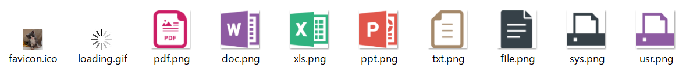

***

## オープンソース活用例(Db2 for i データの可視化)

CLプログラムで設定したパラメーター付きでPythonを呼び出し、Db2 for i のデータをグラフ表示するサンプルのインストール。  
   
実施前に下記前提を確認。  

- [サンプルデータの準備](/demodata/README.md)が完了している
- IBM i でPythonが実行できる環境が構築済み

***

## グラフ化パラメーター指定CLLEプログラム - インストール手順

SAVFをダウンロードしてIBM i に送信、復元。  

SAVFの送信は、ACSのIFSプラグインで拡張子「.SAVF」をライブラリー(/QSYS.LIB/ライブラリー名.lib)に直接(事前にSAVFを作成せずに)アップロードする事も可能。  

### IBM i で空のSAVFを作成

CRTSAVFコマンドで任意の名前のSAVFを作成。

~~~
> CRTSAVF FILE(QGPL/OSSDEMO)                           
   ライブラリー QGPL にファイル OSSDEMO が作成された。 
~~~

  
### SAVFのダウンロード(GitHub→PC)

GitHubからSAVFをダウンロード。

Webブラウザでこのリポジトリーの「[IBM-i-samples/OADEMO/ofdemo.savf](ofdemo.savf)」を開くと、右に「Download」と表示されるのでこれをクリック。  
  

### IBM i のSAVFへ転送

FTPでSAVFをIBM i にput。

~~~
C:\Users\(Windowsのユーザー名)\Desktop>ftp (IBM i のホスト名またはIPアドレス)
(IBM i のホスト名またはIPアドレス) に接続しました。
220-QTCP AT xxx.yyy.CO.JP.
220 CONNECTION WILL CLOSE IF IDLE MORE THAN 5 MINUTES.
501 OPTS UNSUCCESSFUL; SPECIFIED SUBCOMMAND NOT RECOGNIZED.
ユーザー (ibmi:(none)): (IBM i ユーザー名)
331 ENTER PASSWORD.
パスワード: (IBM i パスワード)
230 ZZZZ LOGGED ON.
ftp> bi
200 REPRESENTATION TYPE IS BINARY IMAGE.
ftp> put ossdemo.savf qgpl/ossdemo
200 PORT SUBCOMMAND REQUEST SUCCESSFUL.
150 SENDING FILE TO MEMBER OFDEMO IN FILE OFDEMO IN LIBRARY QGPL.
226 FILE TRANSFER COMPLETED SUCCESSFULLY.
ftp: 54912 バイトが送信されました 0.33秒 164.41KB/秒。
ftp> quit
221 QUIT SUBCOMMAND RECEIVED.
~~~
  

### オブジェクトの復元

任意のライブラリー(この例では「GURILIB」)に転送したSAVFから復元。  
復元後はSAVFは削除可能。

~~~
> RSTOBJ OBJ(*ALL) SAVLIB(DIST) DEV(*SAVF) SAVF(QGPL/OFDEMO) RSTLIB(GURILIB
  )                                                                        
  1 個のオブジェクトを DIST から GURILIB へ復元した。                      
~~~
    
### オブジェクトの編集と作成

実行環境に合わせてソースを編集。  

**CCSIDが5026(日本語カタカナ)のソースファイルで不変文字セットの英小文字を入力する場合は下記の環境で実施。**
- 5250エミュレーターのホスト・コード・ページが**939**または**1399**
- SEUでの編集**前**に「CHGJOB CCSID(65535)」を実行

 
   
ソースファイル「OFDEMO」のメンバー「OFSEARCHR」中の「XX.XX.XX.XX」を稼働するIBM i のホスト名またはIPアドレスに変更。  

|メンバー|行|ステートメント|
|-------|--|-------|
|OFSEARCHR|0062.00|DhostIP           C                   '**XX.XX.XX.XX**'|

~~~
> STRSEU SRCFILE(GURILIB/OFDEMO) SRCMBR(OFSEARCHR) 
~~~

   
   
ソースファイル「OFDEMO」のメンバー「UDTFSPLF」中の「DIST」を実行オブジェクトを配置するライブラリー名(例えば「GURILIB」)に変更。  
※ SEUのコマンド行に「C DIST GURILIB ALL」と入力して実行すれば一括置換が可能  

|メンバー|行|ステートメント|
|-------|--|-------|
|UDTFSPLF|0008.00|CREATE OR REPLACE FUNCTION **DIST**.SPOOLED_FILE_DBCS (|
||0016.00|SPECIFIC **DIST**.SPOOL_FILE_DBCS|
||0055.00|'QSYS/CALL PGM(**DIST**/SHIFTUDTF)' ) ;|
||0074.00|COMMENT ON SPECIFIC FUNCTION **DIST**.SPOOL_FILE_DBCS|
||0078.00|ON SPECIFIC FUNCTION **DIST**.SPOOL_FILE_DBCS|
||0082.00|ON SPECIFIC FUNCTION **DIST**.SPOOL_FILE_DBCS|

~~~
> STRSEU SRCFILE(GURILIB/OFDEMO) SRCMBR(UDTFSPLF) 
~~~

   

自動でサンプルをコンパイルするREXXプロシージャー「MAKE」を使用。  
※ 個別にCLコマンドでコンパイルしても良い    

ソースファイル「OFDEMO」のメンバー「MAKE」の変数 OLIB(オブジェクト・ライブラリー)、および、SLIB(ソース・ライブラリー)の設定値を編集。

~~~
> STRSEU SRCFILE(GURILIB/OFDEMO) SRCMBR(MAKE) 
~~~

編集前
~~~
0015.00 OLIB = 'DIST'   
0016.00 SLIB = 'DIST'   
〜〜〜〜〜〜〜〜〜〜〜〜〜
0046.00   "            FROM TABLE (TSOUTQ.TS_OUTQ(''TSOUTQ'', '' ファイル '')) X ",
〜〜〜〜〜〜〜〜〜〜〜〜〜
0053.00   "            FROM TABLE (TSIFS.TS_IFS(''TSIFS'', ''V7R1'')) X ",
〜〜〜〜〜〜〜〜〜〜〜〜〜
~~~

編集後(この例ではオブジェクト、ソースともにライブラリー「GURILIB」に配置)  
※ 46/53行の「検索文字列」は該当のデータがヒットする任意の文字列を指定
~~~
0015.00 OLIB = 'GURILIB'  
0016.00 SLIB = 'GURILIB'  
〜〜〜〜〜〜〜〜〜〜〜〜〜
0046.00   "            FROM TABLE (TSOUTQ.TS_OUTQ(''TSOUTQ'', ''検索文字列'')) X ",
〜〜〜〜〜〜〜〜〜〜〜〜〜
0053.00   "            FROM TABLE (TSIFS.TS_IFS(''TSIFS'', ''検索文字列'')) X ",
〜〜〜〜〜〜〜〜〜〜〜〜〜
~~~

STRREXPRCコマンドを実行(またはPDMでメンバーMAKEにオプション16を指定)するとコンパイルが実行される。

~~~
> STRREXPRC SRCMBR(MAKE) SRCFILE(GURILIB/OFDEMO)
~~~

画面に実行内容と結果が表示されるので、指示に従って動作を確認。

~~~
     「 IBM i で全文検索」オブジェクトの作成                        
                                                                    
    ****************************************************************
    **  OMNIFIND 検索定義を作成したユーザーで実行（借用権限）     **
    **  ユーザーがオブジェクト作成に必要な権限を所有              **
    **  オブジェクトライブラリー、ソースは事前に準備              **
    **  OMNIFIND がインストール／構成済みで検索が実行できる事     **
    **  このソース内の OLIB, SLIB を実際のライブラリーに修正      **
    **  RUNSQL 内の検索語２箇所をヒットがある語句に修正           **
    **  ソースメンバー OFSEARCHR の IP アドレスを                 **
    **    実際の IBM i の IP アドレスに修正。                     **
    **  ソースメンバー UDTFSPLF の「 DIST 」を                    **
    **    実際のライブラリー名に修正。                            **
    ****************************************************************
                                                                    
    現行ライブラリーを GURILIB に変更します。                       
    現行ジョブの CCSID を 1399 に変更します。                       
                                                                    
    スプール検索出力ファイル作成                                    
      スプール検索出力ファイルの作成 ...                            
       結果 -> 0                                                    
      IFS 検索出力ファイル作成 ...                                  
       結果 -> 0                                                    
                                                                    
    スプールファイルデータの取得用 UDTF の作成                      
      ILE-RPG プログラム SHIFTUDTF の作成  ...                      
       結果 -> 0                                                    
      SQL-UDTF UDTFSPLF の作成  ...                                 
       結果 -> 0                                                             
                                                                             
    ILE-RPG 検索アプリケーションの作成                                       
      表示装置ファイル OFSEARCHD の作成  ...                                 
       結果 -> 0                                                             
      ILE-RPG プログラム OFSEARCHR の作成  ...                               
       結果 -> 0                                                             
                                                                             
    エラー（結果が 0 以外）の有無を確認してください。                        
    エラーがある場合はジョブログで原因を確認し、修正して再実行します。       
                                                                             
    下記コマンドで検索アプリケーションを実行できます。                       
    ※このプロシージャーの冒頭で現行ライブラリーを GURILIB に変更しています。
      CALL OFSEARCHR                                                         
                                                                             
    プロシージャーの終わり。                                                 
~~~
---  

## オープンソース活用例 - インストール手順

IBM i におけるオープンソースアプリケーションの開発については[OSSSETUP.md](/OSSDEMO/OSSSETUP.md)を参照。  

オープンソース活用例(Db2 for i データの可視化)のインストールでは下記の作業を実施。   
   
- Web検索アプリケーション(Node.jsスクリプト)の実行環境を構築
- Webアプリケーションおよび関連ファイルの配置
- Webアプリケーションの起動と終了

  
基本的に5250画面ではなく、sshターミナルから作業を行う。
   
---
   
### Node.js実行環境の確認

次の事項を確認。

● IBM i へのssh接続  
● Node.jsのデフォルト・バージョンの設定  
● ODBC接続の確認  
● Webアプリケーションで使用するモジュールのインストール     
   

---

- sshでIBM i にログイン
   
~~~
C:\Users\(Windowsのユーザー名)>ssh guri@xxxx (「xxxx」はIBM i のIPアドレスまたはホスト名)
guri@xxxx's password:
$ pwd
/home/GURI   
$ PATH=/QOpenSys/pkgs/bin:$PATH   
$ exec bash
bash-5.1$   
~~~   
  
   
- Node.jsのバージョン14をデフォルトとして使用  

※ 直接Node.jsのバイナリを指定する場合は「[Setting the Node.js major version](https://ibmi-oss-docs.readthedocs.io/en/latest/nodejs/README.html)」を参照  
※ [IBMの資料](https://ibmi-oss-docs.readthedocs.io/en/latest/nodejs/README.html#setting-the-node-js-major-version)ではnodeverを紹介しているが、「[Goodbye, Nodever! Hello, update-alternatives!](https://techchannel.com/SMB/05/2020/update-alternatives)」によると非推奨     
※ alternativesはRed Hat系の拡張で全環境のデフォルトを変更する。開発/テスト/教育などでPythonの仮想環境を複数用意する場合はnpmで制御  
※ 実行時エラーが発生する場合は他のnodeバージョンを試して切り分けを行う。関連モジュールによってはnodeのバージョン10などでも稼働する  

~~~
bbash-5.1$ alternatives --config node
There are 6 choices for the alternative node (providing /QOpenSys/pkgs/bin/node).

  Selection    Path                                  Priority   Status
------------------------------------------------------------
  0            /QOpenSys/pkgs/lib/nodejs18/bin/node   18        auto mode
* 1            /QOpenSys/pkgs/lib/nodejs10/bin/node   10        manual mode
  2            /QOpenSys/pkgs/lib/nodejs12/bin/node   12        manual mode
  3            /QOpenSys/pkgs/lib/nodejs14/bin/node   14        manual mode
  4            /QOpenSys/pkgs/lib/nodejs16/bin/node   16        manual mode
  5            /QOpenSys/pkgs/lib/nodejs18/bin/node   18        manual mode
  6            /QOpenSys/pkgs/lib/nodejs8/bin/node    8         manual mode

Press <enter> to keep the current choice[*], or type selection number: 3
update-alternatives: using /QOpenSys/pkgs/lib/nodejs14/bin/node to provide /QOpenSys/pkgs/bin/node (node) in manual mode
bash-5.1$ node -v
v14.21.1
~~~
   
- ODBCでDb2 for i に接続できることを確認
~~~
bash-5.1$ export LANG=JA_JP.UTF-8
bash-5.1$ isql *local
+---------------------------------------+
| Connected!                            |
|                                       |
| sql-statement                         |
| help [tablename]                      |
| quit                                  |
|                                       |
+---------------------------------------+
SQL> select regno,kjname from gurilib.person fetch first 5 rows only
+--------+-------------------------------------------------------------------+
| REGNO  | KJNAME                                                            |
+--------+-------------------------------------------------------------------+
| 1      | 滝川　厚                                                      |
| 2      | 川西　節男                                                   |
| 3      | 藤井　咲                                                      |
| 4      | 吉澤　智之                                                   |
| 5      | 花田　蓮大                                                   |
+--------+-------------------------------------------------------------------+
SQLRowCount returns -1
5 rows fetched
SQL> quit   
~~~

 
   
- Webアプリケーションで使用するNodeモジュールのインストール  
※ アプリケーションのインストール先ディレクトリーを「~/omnifind」とする
~~~
bash-5.1$ mkdir ofdemo
bash-5.1$ cd ofdemo/
bash-5.1$ npm init -y
Wrote to /home/GURI/ofdemo/package.json:

{
  "name": "ofdemo",
  "version": "1.0.0",
  "description": "",
  "main": "index.js",
  "scripts": {
    "test": "echo \"Error: no test specified\" && exit 1"
  },
  "keywords": [],
  "author": "",
  "license": "ISC"
}

bash-5.1$ npm install --save-dev odbc

> odbc@2.4.6 install /home/GURI/ofdemo/node_modules/odbc
> node-pre-gyp install --fallback-to-build

[odbc] Success: "/home/GURI/ofdemo/node_modules/odbc/lib/bindings/napi-v6/odbc.node" is installed via remote
npm notice created a lockfile as package-lock.json. You should commit this file.
npm WARN ofdemo@1.0.0 No description
npm WARN ofdemo@1.0.0 No repository field.

+ odbc@2.4.6
added 59 packages from 103 contributors and audited 59 packages in 12.466s

4 packages are looking for funding
  run `npm fund` for details

found 0 vulnerabilities

bash-5.1$ npm install --save-dev path
npm WARN ofdemo@1.0.0 No description
npm WARN ofdemo@1.0.0 No repository field.

+ path@0.12.7
added 4 packages from 2 contributors and audited 63 packages in 2.773s

4 packages are looking for funding
  run `npm fund` for details

found 0 vulnerabilities

bash-5.1$ npm install --save-dev express
npm WARN ofdemo@1.0.0 No description
npm WARN ofdemo@1.0.0 No repository field.

+ express@4.18.2
added 61 packages from 41 contributors and audited 124 packages in 7.038s

10 packages are looking for funding
  run `npm fund` for details

found 0 vulnerabilities

   ╭───────────────────────────────────────────────────────────────╮
   │                                                               │
   │     New major version of npm available! 6.14.12 -> 9.1.3      │
   │   Changelog: https://github.com/npm/cli/releases/tag/v9.1.3   │
   │               Run npm install -g npm to update!               │
   │                                                               │
   ╰───────────────────────────────────────────────────────────────╯

bash-5.1$
~~~
   
 

   
### Webアプリケーションおよび関連ファイルの配置
   
 

- IFSにNode.jsスクリプトを配置  
   
このリポジトリーの「[OMNIFIND.js](OMNIFIND.js)」をディレクトリー「~/omnifind」に配置。  
※ FTP、NetServer、IFSストリームファイルのエディタ(EDTFコマンド、vi、その他)にcopy&paste、など、任意の方法で実施。下記はcurlコマンドの例。
~~~
bash-5.1$ curl 'https://raw.githubusercontent.com/GuriCat/IBM-i-samples/master/OFDEMO/OMNIFIND.js' > OMNIFIND.js
  % Total    % Received % Xferd  Average Speed   Time    Time     Time  Current
                                 Dload  Upload   Total   Spent    Left  Speed
100  5147  100  5147    0     0  83016      0 --:--:-- --:--:-- --:--:-- 84377   
bash-5.1$ ls -la
total 180
drwxr-sr-x   3 guri 0 12288 Dec  5 15:55 .
drwxr-sr-x   6 guri 0  8192 Dec  5 14:21 ..
-rw-r--r--   1 guri 0  5147 Dec  5 15:55 OMNIFIND.js
drwxr-sr-x 116 guri 0 73728 Dec  5 15:34 node_modules
-rw-r--r--   1 guri 0 40808 Dec  5 15:34 package-lock.json
-rw-r--r--   1 guri 0   318 Dec  5 15:34 package.json
~~~

    

- Node.jsのWebサーバー(Express)用にファイルを配置
   
ディレクトリー「~/ofdemo」に「[index.html](index.html)」を配置。  
~~~
bash-5.1$ pwd
/home/GURI/ofdemo
bash-5.1$ curl https://raw.githubusercontent.com/GuriCat/IBM-i-samples/master/OFDEMO/index.html > index.html
  % Total    % Received % Xferd  Average Speed   Time    Time     Time  Current
                                 Dload  Upload   Total   Spent    Left  Speed
100 13393  100 13393    0     0  44055      0 --:--:-- --:--:-- --:--:-- 44201   
bash-5.1$ ls -la
total 212
drwxr-sr-x   3 guri 0 12288 Dec  5 18:05 .
drwxr-sr-x   6 guri 0  8192 Dec  5 16:26 ..
-rw-r--r--   1 guri 0  5147 Dec  5 15:55 OMNIFIND.js
-rw-r--r--   1 guri 0 13393 Dec  5 17:45 index.html
drwxr-sr-x 116 guri 0 73728 Dec  5 15:34 node_modules
-rw-r--r--   1 guri 0 40808 Dec  5 15:34 package-lock.json
-rw-r--r--   1 guri 0   318 Dec  5 15:34 package.json
~~~

 

任意のエディターで「[index.html](index.html)」を編集。  

PC文書を保管したIFSのディレクトリー長に合わせて数値を変更。  
例えば実パスが「/home/GURI/PCDOC」の場合、「/PCDOC」の前の文字数(10)を指定。  
この例では「/TMP/PCDOC」なので、10⇒4に変更。

|ファイル|行|ステートメント|
|-------|--|-------|
|/home/GURI/ofdemo/index.html|284|substr(**10**)|

    

ディレクトリー「~/ofdemo」下にディレクトリー「public」と「public/image」を作成し、アイコンイメージを配置。

※ イメージ数がそれほど多くないので下ではwgetで実施しているが、多数の場合はNetServerやFTPの利用を考慮。  

~~~
bash-5.1$ mkdir public
bash-5.1$ cd public/
bash-5.1$ mkdir image
bash-5.1$ cd image/
bash-5.1$ pwd
/home/GURI/ofdemo/public/image  
bash-5.1$ wget -nv https://raw.githubusercontent.com/GuriCat/IBM-i-samples/master/OFDEMO/image/doc.png
2022-12-05 17:25:33 URL:https://raw.githubusercontent.com/GuriCat/IBM-i-samples/master/OFDEMO/image/doc.png [13843/13843] -> "doc.png" [1]
bash-5.1$ wget -nv https://raw.githubusercontent.com/GuriCat/IBM-i-samples/master/OFDEMO/image/favicon.ico
2022-12-05 18:08:20 URL:https://raw.githubusercontent.com/GuriCat/IBM-i-samples/master/OFDEMO/image/favicon.ico [16958/16958] -> "favicon.ico" [1]
bash-5.1$ wget -nv https://raw.githubusercontent.com/GuriCat/IBM-i-samples/master/OFDEMO/image/file.png
2022-12-05 18:08:35 URL:https://raw.githubusercontent.com/GuriCat/IBM-i-samples/master/OFDEMO/image/file.png [4980/4980] -> "file.png" [1]
bash-5.1$ wget -nv https://raw.githubusercontent.com/GuriCat/IBM-i-samples/master/OFDEMO/image/loading.gif
2022-12-05 18:08:44 URL:https://raw.githubusercontent.com/GuriCat/IBM-i-samples/master/OFDEMO/image/loading.gif [15055/15055] -> "loading.gif" [1]
bash-5.1$ wget -nv https://raw.githubusercontent.com/GuriCat/IBM-i-samples/master/OFDEMO/image/pdf.png
2022-12-05 18:08:55 URL:https://raw.githubusercontent.com/GuriCat/IBM-i-samples/master/OFDEMO/image/pdf.png [13958/13958] -> "pdf.png" [1]
bash-5.1$ wget -nv https://raw.githubusercontent.com/GuriCat/IBM-i-samples/master/OFDEMO/image/ppt.png
2022-12-05 18:09:03 URL:https://raw.githubusercontent.com/GuriCat/IBM-i-samples/master/OFDEMO/image/ppt.png [12346/12346] -> "ppt.png" [1]
bash-5.1$ wget -nv https://raw.githubusercontent.com/GuriCat/IBM-i-samples/master/OFDEMO/image/sys.png
2022-12-05 18:09:10 URL:https://raw.githubusercontent.com/GuriCat/IBM-i-samples/master/OFDEMO/image/sys.png [3305/3305] -> "sys.png" [1]
bash-5.1$ wget -nv https://raw.githubusercontent.com/GuriCat/IBM-i-samples/master/OFDEMO/image/txt.png
2022-12-05 18:09:19 URL:https://raw.githubusercontent.com/GuriCat/IBM-i-samples/master/OFDEMO/image/txt.png [7309/7309] -> "txt.png" [1]
bash-5.1$ wget -nv https://raw.githubusercontent.com/GuriCat/IBM-i-samples/master/OFDEMO/image/usr.png
2022-12-05 18:09:27 URL:https://raw.githubusercontent.com/GuriCat/IBM-i-samples/master/OFDEMO/image/usr.png [3292/3292] -> "usr.png" [1]
bash-5.1$ wget -nv https://raw.githubusercontent.com/GuriCat/IBM-i-samples/master/OFDEMO/image/xls.png
2022-12-05 18:09:36 URL:https://raw.githubusercontent.com/GuriCat/IBM-i-samples/master/OFDEMO/image/xls.png [12524/12524] -> "xls.png" [1]   
bash-5.1$ ls -la
total 256
drwxr-sr-x 2 guri 0  8192 Dec  6 13:53 .
drwxr-sr-x 3 guri 0  8192 Dec  6 13:50 ..
-rw-r--r-- 1 guri 0 13843 Dec  6 13:51 doc.png
-rw-r--r-- 1 guri 0 16958 Dec  6 13:52 favicon.ico
-rw-r--r-- 1 guri 0  4980 Dec  6 13:52 file.png
-rw-r--r-- 1 guri 0 15055 Dec  6 13:52 loading.gif
-rw-r--r-- 1 guri 0 13958 Dec  6 13:52 pdf.png
-rw-r--r-- 1 guri 0 12346 Dec  6 13:52 ppt.png
-rw-r--r-- 1 guri 0  3305 Dec  6 13:52 sys.png
-rw-r--r-- 1 guri 0  7309 Dec  6 13:52 txt.png
-rw-r--r-- 1 guri 0  3292 Dec  6 13:53 usr.png
-rw-r--r-- 1 guri 0 12524 Dec  6 13:53 xls.png
~~~
   
 
(アイコンイメージ)  

   
 

Express WebサーバーがPC文書にアクセスするため、ディレクトリー「public」下に「/TMP/PCDOC」へのシンボリック・リンクを作成。
~~~
bash-5.1$ cd ~/ofdemo/public/
bash-5.1$ ln -s /TMP/PCDOC ./PCDOC
bash-5.1$ export LANG=JA_JP.UTF-8
bash-5.1$ ls ./PCDOC/PDF
'2022-02-09 2025年の崖の信ぴょう性.pdf'
'Backup and Recovery (バックアップおよび回復の手引き、SD88-5008) - c4153045.pdf'
CLLE4_20200727165224793168.PDF
〜〜〜〜〜〜〜〜〜〜〜〜〜〜〜〜〜〜〜〜〜〜〜〜〜〜〜〜〜〜〜〜
~~~

 

(この時点でのファイル配置)

~~~
bash-5.1$ cd ~/ofdemo/
bash-5.1$ ls -la
total 220
drwxr-sr-x   4 guri 0 12288 Dec  6 13:50 .
drwxr-sr-x   6 guri 0  8192 Dec  6 10:46 ..
-rw-r--r--   1 guri 0  5147 Dec  5 15:55 OMNIFIND.js
-rw-r--r--   1 guri 0 13393 Dec  5 17:45 index.html
drwxr-sr-x 116 guri 0 73728 Dec  5 15:34 node_modules
-rw-r--r--   1 guri 0 40808 Dec  5 15:34 package-lock.json
-rw-r--r--   1 guri 0   318 Dec  5 15:34 package.json
drwxr-sr-x   3 guri 0  8192 Dec  6 14:26 public
bash-5.1$ tree -I 'node*|package*' -p -u
.
├── [-rw-r--r-- guri    ]  OMNIFIND.js
├── [-rw-r--r-- guri    ]  index.html
└── [drwxr-sr-x guri    ]  public
    ├── [lrwxrwxrwx guri    ]  PCDOC -> /TMP/PCDOC
    └── [drwxr-sr-x guri    ]  image
        ├── [-rw-r--r-- guri    ]  doc.png
        ├── [-rw-r--r-- guri    ]  favicon.ico
        ├── [-rw-r--r-- guri    ]  file.png
        ├── [-rw-r--r-- guri    ]  loading.gif
        ├── [-rw-r--r-- guri    ]  pdf.png
        ├── [-rw-r--r-- guri    ]  ppt.png
        ├── [-rw-r--r-- guri    ]  sys.png
        ├── [-rw-r--r-- guri    ]  txt.png
        ├── [-rw-r--r-- guri    ]  usr.png
        └── [-rw-r--r-- guri    ]  xls.png

3 directories, 12 files
~~~

 

- Node.jsスクリプトの動作確認

sshセッションからNode.jsスクリプト「OMNIFIND.js」を起動。  
起動後はこのセッション(A)にWebブラウザからの検索リクエストが表示される。
~~~
bash-5.1$ node OMNIFIND.js
~~~

 
もう一つsshセッション(B)を開き、curlコマンドでhttpリクエストを送信、結果を表示する。  

 

(スプール検索[GET])  
~~~
C:\Users\(Windowsのユーザー名)>ssh guri@xxxx (「xxxx」はIBM i のIPアドレスまたはホスト名)
guri@idemo's password:
$ PATH=/QOpenSys/pkgs/bin:$PATH
$ exec bash
bash-5.1$ export LANG=JA_JP.UTF-8
bash-5.1$ curl -v --get --data-urlencode '{"search_target":"ifs","search_extended":"0","search_word":"ジョブ","search_action":"検索の実行"}' http://127.0.0.1:8080/api/fts/v1/search/spl | jq -r '. | fromjson'
*   Trying 127.0.0.1:8080...
  % Total    % Received % Xferd  Average Speed   Time    Time     Time  Current
                                 Dload  Upload   Total   Spent    Left  Speed
  0     0    0     0    0     0      0      0 --:--:-- --:--:-- --:--:--     0* Connected to 127.0.0.1 (127.0.0.1) port 8080 (#0)
> GET /api/fts/v1/search/spl?%7B%22search_target%22%3A%22ifs%22%2C%22search_extended%22%3A%220%22%2C%22search_word%22%3A%22%E3%82%B8%E3%83%A7%E3%83%96%22%2C%22search_action%22%3A%22%E6%A4%9C%E7%B4%A2%E3%81%AE%E5%AE%9F%E8%A1%8C%22%7D HTTP/1.1
> Host: 127.0.0.1:8080
> User-Agent: curl/7.76.1
> Accept: */*
>
  0     0    0     0    0     0      0      0 --:--:--  0:00:05 --:--:--     0* Mark bundle as not supporting multiuse
< HTTP/1.1 200 OK
< X-Powered-By: Express
< Content-Type: application/json; charset=utf-8
< Content-Length: 3903
< ETag: W/"f3f-zw74vSA+7iRk6cDpJiEdL3busOU"
< Date: Tue, 06 Dec 2022 08:01:12 GMT
< Connection: keep-alive
< Keep-Alive: timeout=5
<
{ [3903 bytes data]
100  3903  100  3903    0     0    627      0  0:00:06  0:00:06 --:--:--   881
* Connection #0 to host 127.0.0.1 left intact
[
〜〜〜〜〜〜〜〜〜〜〜〜〜〜〜〜〜〜〜〜〜〜〜〜〜〜〜〜〜
  {
    "OBJECT_LIB": "QGPL      ",
    "OBJECT_NAM": "QPRINT    ",
    "JOB_NAME": "QPADEV0002",
    "USER_NAME": "KOKI      ",
    "JOB_NBR": "263496",
    "SPOOL_NAME": "QPDZDTALOG",
    "SPOOL_NBR": "6     ",
    "SYS_NAME": "PWR74A    ",
    "CRT_DATE": "1220914",
    "CRT_TIME": "072737",
    "SCORE": 62.6,
    "OBJTYPE": "*OUTQ     ",
    "OBJATTR": "*SPLF     ",
    "MODIFY_TIME": "2022-09-14 07:27:37.000000"
  }
]
~~~

 

(IFS検索[POST])
~~~
bash-5.1$ curl -v -X POST -H "Content-Type: application/json" -d '{"search_target":"ifs","search_extended":"0","search_word":"V7R1","search_action":"検索の実行"}'  http://127.0.0.1:8080/api/fts/v1/search/ifs | jq -r '. | fromjson'
Note: Unnecessary use of -X or --request, POST is already inferred.
*   Trying 127.0.0.1:8080...
  % Total    % Received % Xferd  Average Speed   Time    Time     Time  Current
                                 Dload  Upload   Total   Spent    Left  Speed
  0     0    0     0    0     0      0      0 --:--:-- --:--:-- --:--:--     0* Connected to 127.0.0.1 (127.0.0.1) port 8080 (#0)
> POST /api/fts/v1/search/ifs HTTP/1.1
> Host: 127.0.0.1:8080
> User-Agent: curl/7.76.1
> Accept: */*
> Content-Type: application/json
> Content-Length: 100
>
} [100 bytes data]
100   100    0     0  100   100      0     22  0:00:04  0:00:04 --:--:--    22* Mark bundle as not supporting multiuse
< HTTP/1.1 200 OK
< X-Powered-By: Express
< Content-Type: application/json; charset=utf-8
< Content-Length: 413
< ETag: W/"19d-y2PTDxNEdvMCCePqj/qqDlNZpAo"
< Date: Tue, 06 Dec 2022 08:07:27 GMT
< Connection: keep-alive
< Keep-Alive: timeout=5
<
{ [413 bytes data]
100   513  100   413  100   100     90     21  0:00:04  0:00:04 --:--:--   112
* Connection #0 to host 127.0.0.1 left intact
[
  {
    "OBJECT_NAME": "/TMP/PCDOC/OFFICE/IBM i 5.4から7.1への移行情報_Rev2.0.ppt",
    "SCORE": 5.3,
    "OBJTYPE": "*STMF     ",
    "OBJATTR": "*DATA     ",
    "MODIFY_TIME": "2012-07-19 02:43:54.000000"
  },
  {
    "OBJECT_NAME": "/TMP/PCDOC/OFFICE/IBM i 7.1 2012年4月 機能拡張詳細_Rev2.0.ppt",
    "SCORE": 4.3,
    "OBJTYPE": "*STMF     ",
    "OBJATTR": "*DATA     ",
    "MODIFY_TIME": "2012-07-26 00:54:26.000000"
  }
]
~~~

 

### Webアプリケーションの起動と終了

- Nodeアプリケーションの起動

下記いずれかの方法で起動。

1. sshセッションから「node OMNIFIND.js &」でバックグラウンドで実行
1. CLコマンドからPASEシェルを呼び出して実行

 

(CLコマンドから起動する例)  
スクリプトOMNIFIND.jsと同じディレクトリーに「[start.sh](start.sh)」を配置。
~~~
bash-5.1$ pwd
/home/GURI/ofdemo
bash-5.1$ wget -nv https://raw.githubusercontent.com/GuriCat/IBM-i-samples/master/OFDEMO/start.sh
2022-12-07 14:34:08 URL:https://raw.githubusercontent.com/GuriCat/IBM-i-samples/master/OFDEMO/start.sh [105/105] -> "start.sh" [1]
bash-5.1$ ls -la
total 244
drwxr-sr-x   4 guri 0 12288 Dec  7 14:34 .
drwxr-sr-x   8 guri 0 24576 Dec  7 11:03 ..
-rw-r--r--   1 guri 0  4898 Dec  7 11:48 OMNIFIND.js
-rw-r--r--   1 guri 0 13283 Dec  7 11:33 index.html
drwxr-sr-x 116 guri 0 73728 Dec  5 15:34 node_modules
-rw-r--r--   1 guri 0 40808 Dec  5 15:34 package-lock.json
-rw-r--r--   1 guri 0   318 Dec  5 15:34 package.json
drwxr-sr-x   3 guri 0  8192 Dec  6 14:26 public
-rw-r--r--   1 guri 0   105 Dec  7 14:34 start.sh
~~~

任意のエディターで「[start.sh](start.sh)」の2行目のパスをWebアプリケーションの配置ディレクトリーに変更。

|ファイル|行|ステートメント|
|-------|--|-------|
|/home/GURI/ofdemo/start.sh|2|cd **/home/GURI/ofdemo**|

OMNIFIND検索定義を作成したユーザーでサインオンし、下記のCLコマンドを実行。  
※ start.shのパス名を適宜修正  
~~~
> CHGJOB CCSID(1399)                                                       
> SBMJOB CMD(CALL PGM(QP2SHELL) PARM(('/QOpenSys/pkgs/bin/bash') ('/home/GU
  RI/ofdemo/start.sh'))) JOB(OMNINODE) CCSID(1399)                         
   ジョブ 382857/GURI/OMNINODE がライブラリー QGPL のジョブ待ち行列 QBATCH 
     に投入された。                                                                                                               
~~~

CLプログラム化する場合は、OMNIFIND検索定義を作成したユーザーでサインオン→CRTCLPGM/CRTBNDCLコマンドでUSRPRF(*OWNER)を指定してコンパイル(借用権限)。あるいは、UDTF(TS_IFSおよびTS_OUTQ)に必要な権限を付与。  

サンプル・プログラム「[OFSTART.CLLE](OFSTART.CLLE)」では下記を実施。  
- Webアプリケーション(OMNIFIND.js)の死活確認と起動
- OmniFind全文検索エンジンの起動
- [45行目](https://github.com/GuriCat/IBM-i-samples/blob/e5bb35399876f6887928ac96a7d2a666cea92b2c/OFDEMO/OFSTART.CLLE#L45)のパス名を適宜修正

 

正常に実行しているかWRKSBMJOBコマンドで確認。
~~~
                               投入ジョブの処理                        XXXXXX   
                                                         22/12/07  15:16:07 JST 
 投入元 . . . . . . . . . . . . :   *USER                                       
                                                                                
 オプションを入力して，実行キーを押してください。                               
   2= 変更   3= 保留   4= 終了   5= 処理   6= 解放   7= メッセージ表示          
   8=ﾇﾎﾟｰﾓ､ﾎｦbﾓ の処理                                                          
                                                                                
                                                                                
 OPT   ジョブ      ユーザー     タイプ   ----- 状況 -----   機能                 
      OMNINODE    GURI        BATCH     ACTIVE            PGM-bash              
      OMNINODE    GURI        BATCHI    ACTIVE            PGM-node              
                                                                                
~~~

 

Webブラウザから「http://(IBM i ホスト名またはIPアドレス):8080」でアクセスし、「IBM i 日本語全文検索」ページが表示される事を確認。  

 

- Nodeアプリケーションの終了

下記いずれかの方法で終了。

1. Nodeを起動したセッション(A)でCtrl+Cを押す
1. セッション(B)からpsコマンドでプロセスを終了
1. WRKACTJOBコマンドで「機能」が「PGM-node」のジョブをENDJOBで終了

(psコマンドで終了する例)
~~~
bash-5.1$ ps a
   PID    TTY STAT  TIME COMMAND
 34069  pts/0 A     0:00 bash
 34121  pts/1 A     0:00 bash
 34303  pts/0 A     0:00 node OMNIFIND.js
 34308  pts/1 A     0:00 ps a
bash-5.1$ kill 34303
bash-5.1$ ps a
   PID    TTY STAT  TIME COMMAND
 34069  pts/0 A     0:00 bash
 34121  pts/1 A     0:00 bash
 34309  pts/1 A     0:00 ps a
~~~
