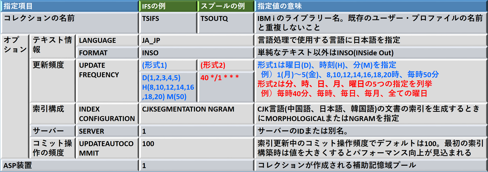

***

## IBM i で全文検索 - OmniFindのインストールと環境構築

全文検索アプリケーションの稼働前提である「OMNIFIND TEXT SEARCH SERVER FOR DB2 FOR I」をインストールし、スプールファイルおよびIFS上のPC文書の検索を可能にする。

**システム値 QCCSIDが65535(出荷時値。無変換を示す特殊値)の場合はIBMの正式サポート外となる(2022/11時点でIBM正規ドキュメントにその旨の記載は無し)**

***

### OmniFindのインストール

「[OmniFind for IBM i](https://www.ibm.com/support/pages/omnifind-ibm-i)」に記載の表を参照し、インストール先のIBM i のバージョンに対応したバージョンのOmniFindのイメージ・ファイルを入手。このイメージ・ファイルをイメージカタログに登録し、インストールを行う。

以下の例ではIBM i 7.4用にOmniFind 1.5をインストール。

イメージカタログ、および、イメージ保管ディレクトリーの作成。
~~~
> CRTIMGCLG IMGCLG(OMNIFIND15) DIR('/LPP/OMNIFIND/') CRTDIR(*YES)
   イメージ・カタログ OMNIFIND15 がライブラリー QUSRSYS に作成された。
~~~

OmniFind 1.5のイメージ(例では「OMNIFIND15.udf」。約360MB)をIBM i のIFSにアップロード。
~~~
C:\Users\(Windowsのユーザー名)\Desktop>ftp (IBM i のホスト名またはIPアドレス)
(IBM i のホスト名またはIPアドレス) に接続しました。
220-QTCP AT xxx.yyy.CO.JP.
220 CONNECTION WILL CLOSE IF IDLE MORE THAN 5 MINUTES.
501 OPTS UNSUCCESSFUL; SPECIFIED SUBCOMMAND NOT RECOGNIZED.
ユーザー (ibmi:(none)): (IBM i ユーザー名)
331 ENTER PASSWORD.
パスワード: (IBM i パスワード)
230 ZZZZ LOGGED ON.
ftp> bi
200 REPRESENTATION TYPE IS BINARY IMAGE.
ftp> put OMNIFIND15.udf /LPP/OMNIFIND/OMNIFIND15.udf
200 PORT SUBCOMMAND REQUEST SUCCESSFUL.
150 SENDING FILE TO /LPP/OMNIFIND/OMNIFIND15.udf
226 FILE TRANSFER COMPLETED SUCCESSFULLY.
ftp: 369098752 バイトが送信されました 178.33秒 2069.76KB/秒。
ftp> quit
221 QUIT SUBCOMMAND RECEIVED.
~~~

イメージカタログへの登録、イメージのイメージカタログへのロード、イメージカタログの仮想光ディスク装置へのロード、検証。
~~~
> ADDIMGCLGE IMGCLG(OMNIFIND15) FROMFILE('/LPP/OMNIFIND/OMNIFIND15.UDF') TO
  FILE(*FROMFILE)
   イメージ・カタログ項目がイメージ・カタログ OMNIFIND15 に追加された。
> LODIMGCLGE IMGCLG(OMNIFIND15) OPTION(*LOAD)
   イメージ・カタログ項目 1 がロードされました。
> LODIMGCLG IMGCLG(OMNIFIND15) DEV(OPTVRT01)
   イメージ・カタログ OMNIFIND15 が装置 OPTVRT01 にロードされた。
> VFYIMGCLG IMGCLG(OMNIFIND15) TYPE(*OTHER)
   イメージ・カタログ OMNIFIND15, タイプ *OTHER が検査されました。
~~~

RSTLICPGMコマンドでOmniFindをインストール。
~~~
> RSTLICPGM LICPGM(5733OMF) DEV(OPTVRT01)
   プロダクト 5733OMF オプション *BASE リリース V1R5M0 の *PGM オブジェク
     トが復元された。
   プロダクト 5733OMF オプション *BASE リリース V1R5M0 の NLV 2962 の *LNG
     オブジェクトが復元された。
   プロダクト 5733OMF オプション *BASE リリース *FIRST のオブジェクトが復
     元された。
~~~
インストールで下記画面が表示されたら「F14= 受諾」を押す。
~~~
                               ソフトウェア契約
                                                          システム :   XXXXXX
 ライセンス・プログラム  . . :   5733OMF
  ﾗｲｾﾝｽ･ﾌﾟﾛｸﾞﾗﾑ･ｵﾌﾟｼｮﾝ . . . :   *BASE
 リリース  . . . . . . . . . :   V1R5M0

  プログラムのご使用条件

  第  1  章  -  共通条項

  お客様がライセンシー（使用許諾を受けた個人、会社、その他の法人）とし
  て本件プログラムをダウンロード、導入、複製、アクセス、「同意」ボタンを
  クリック、または使用することにより、本「プログラムのご使用条件   」
 ( 以下「本使用条件」といいます。 )  に同意したものと見なされます。お客様
  がライセンシーの代行者として本使用条件に同意する場合、お客様は、ライセ
  ンシーに本使用条件を遵守させる全権限を有していることを表明および   保証
  いただくものとします。本使用条件に同意いただけない場合、
                                                                       続く ...
 F3= 終了    F6= 印刷    F12= 取り消し   F13= 使用可能な言語の選択   F14= 受諾
 F16= 拒否   F17= 先頭   F18= 最後
~~~

「GO LICPGM」→「10. 導入済みライセンス・プログラムの表示」でインストール結果を確認。  
F11で表示を切り替え、「導入状況:\*INSTALLED」、「導入済みﾘﾘｰｽ:V1R5M0」、「ﾌﾟﾛﾀﾞｸﾄ･ｵﾌﾟｼｮﾝ:\*BASE」になる。
~~~
                     導入済みライセンス・プログラムの表示
                                                          システム :   XXXXXX
 ﾗｲｾﾝｽ･    導入
 ﾌﾟﾛｸﾞﾗﾑ   状況         記述
 5770JV1  *INSTALLED   Jｱﾐｱ SE 11 64 ｲｹﾎ
 5770MG1  *INSTALLED   IBM MANAGED SYSTEM SERVICES FOR I
 5770NAE  *COMPATIBLE  IBM NETWORK AUTHENTICATION ENABLEMENT FOR I
 5733OMF  *INSTALLED   OMNIFIND TEXT SEARCH SERVER FOR DB2 FOR I          
 5770PT1  *COMPATIBLE  IBM PERFORMANCE TOOLS FOR I
~~~

---

### OmniFindのPTFを適用

PTFがあれば[IBM Fix Central](http://www.ibm.com/support/fixcentral/ibmi)からダウンロードして適用。

2022/11時点でOmniFind 1.5に対してPTF SI80330,SI78386,SI78753,SI78754,SI78755,SI77384 が存在。  
以下の操作例では、上記PTFを「omf15ptf_1.bin」という名前でFix Centralからダウンロードした後にイメージカタログから適用。

イメージカタログ、および、イメージ保管ディレクトリーの作成。
~~~
> CRTIMGCLG IMGCLG(OMF15PTF) DIR('/LPP/OMF15PTF/') CRTDIR(*YES)
   イメージ・カタログ OMF15PTF がライブラリー QUSRSYS に作成された。
~~~

OmniFind 1.5のPTFイメージをIBM i のIFSにアップロード。
~~~
C:\Users\(Windowsのユーザー名)\Desktop>ftp (IBM i のホスト名またはIPアドレス)
(IBM i のホスト名またはIPアドレス) に接続しました。
220-QTCP AT xxx.yyy.CO.JP.
220 CONNECTION WILL CLOSE IF IDLE MORE THAN 5 MINUTES.
501 OPTS UNSUCCESSFUL; SPECIFIED SUBCOMMAND NOT RECOGNIZED.
ユーザー (ibmi:(none)): (IBM i ユーザー名)
331 ENTER PASSWORD.
パスワード: (IBM i パスワード)
230 ZZZZ LOGGED ON.
ftp> bi
200 REPRESENTATION TYPE IS BINARY IMAGE.
ftp> put omf15ptf_1.bin /LPP/OMF15PTF/omf15ptf_1.bin
200 PORT SUBCOMMAND REQUEST SUCCESSFUL.
150 SENDING FILE TO /LPP/OMF15PTF/omf15ptf_1.bin
226 FILE TRANSFER COMPLETED SUCCESSFULLY.
ftp: 219211776 バイトが送信されました 109.40秒 2003.82KB/秒。
ftp> quit
221 QUIT SUBCOMMAND RECEIVED.
~~~

イメージカタログへの登録、イメージのイメージカタログへのロード、イメージカタログの仮想光ディスク装置へのロード、検証。
~~~
> ADDIMGCLGE IMGCLG(OMF15PTF) FROMFILE('/LPP/OMF15PTF/OMF15PTF_1.BIN') TOFI
  LE(*FROMFILE)
   イメージ・カタログ項目がイメージ・カタログ OMF15PTF に追加された。
> LODIMGCLGE IMGCLG(OMF15PTF) OPTION(*LOAD)
   イメージ・カタログ項目 1 がロードされました。
> LODIMGCLG IMGCLG(OMNIFIND15) OPTION(*UNLOAD) DEV(OPTVRT01)
   イメージ・カタログ OMNIFIND15 が装置 OPTVRT01 からアンロードされた。
> LODIMGCLG IMGCLG(OMF15PTF) DEV(OPTVRT01)
   イメージ・カタログ OMF15PTF が装置 OPTVRT01 にロードされた。
> VFYIMGCLG IMGCLG(OMF15PTF) TYPE(*PTF)
   イメージ・カタログ OMF15PTF, タイプ *PTF が検査されました。
~~~

PTFの適用。この例で適用したPTF(前提・同時・置き換え含む)は全て即時適用が可能。

「GO PTF」→「8. プログラム一時修正パッケージの導入」を実施。  
装置は使用している仮想光ディスク装置名。即時適用なので自動IPLに「N」、「その他のオプション」に「Y」を入力。
~~~
                      プログラム一時修正の導入オプション
                                                          システム :   XXXXXX
 選択項目を入力して，実行キーを押してください。

   装置  . . . . . . . . . .   OPTVRT01     名前， *SERVICE, *NONE

   自動 IPL  . . . . . . . .   N             Y=YES
                                             N=NO

   媒体のプロンプト  . . . .   1             1= 単一の PTF ボリューム・セット
                                             2= 複数の PTF ボリューム・セット
                                             3= 複数のボリューム・セットおよび
                                              *SERVICE

   再始動タイプ  . . . . . .   *SYS          *SYS, *FULL

   その他のオプション  . . .   Y             Y=YES
                                             N=NO

 F3= 終了   F12= 取り消し
~~~
「適用のタイプ」に「2= 即時適用，遅延 PTF のセット」を指定。
~~~
                            その他の導入オプション
                                                          システム :   XXXXXX
 選択項目を入力して，実行キーを押してください。

    PTF の省略      N            Y=YES, N=NO

   適用のタイプ     2            1= すべての PTF を遅延にセット
                                 2= 即時適用，遅延 PTF のセット
                                 3= 即時 PTF のみ適用

    PTF タイプ      1            1= すべての PTF
                                 2=HIPER PTF と HIPER LIC 修正のみ
                                 3=HIPER LIC 修正のみ
                                 4= ライセンス内部コードの最新表示

    PTF のコピー    N            Y=YES, N=NO
~~~
PTFの導入を実施。
~~~
                              PTF のロード進行中
                                                          システム :   XXXXXX
 ﾌﾟﾛﾀﾞｸﾄ
 ID           記述
 5733OMF     OMNIFIND TEXT SEARCH SERVER FOR DB2 FOR I

~~~

PTFの導入が完了したら、「GO LICPGM」→「50. メッセージのログの表示」で結果を確認。
~~~
                            活動記録ログの内容の表示

 PTF 導入処理が開始された。
 PTF のロードが開始された。
 PTF のロードが正常に完了した。
 PTF の据え置き適用のマーク付けが開始された。
 PTF 適用が開始された。
  プロダクト *ALL に対する PTF の適用が正常に完了した。
 PTF の遅延適用のマーク付けが正常に完了した。
 PTF が正常に導入された。

~~~
下記SQLを実行し、遅延適用PTFが無い(SQLの結果に行が無い)事を確認。
~~~
SELECT PTF_IDENTIFIER, PTF_IPL_ACTION, A.*
  FROM QSYS2.PTF_INFO A
  WHERE PTF_IPL_ACTION <> 'NONE'
~~~

---

### OmniFind検索サーバーの構成

前述したように、**システム値 QCCSIDが65535の場合はIBMの正式サポート外**だが、OmniFind提供ユーザーのCCSIDを変更すれば稼働実績あり(IBM i 7.4および7.5)。

ユーザー・プロフィール「QDBTS」(IBM DB2 OMNIFIND USER PROFILE)のCCSIDを5035または1399に変更。
~~~
> CHGUSRPRF USRPRF(QDBTS) CCSID(5035)
   ユーザー・プロファイル QDBTS が変更された。
~~~

**ユーザープロフィールQDBTSの状況(STATUS)が*DISABLEDになっている場合は*ENABLEDに変更。**

出荷時に提供されるOmniFindのデフォルトサーバー構成ファイルの内容を確認。
~~~
select * from QSYS2.SYSTEXTSERVERS

または

> RUNQRY QRYFILE((QSYS2/SYSTXTSRVR)) 
~~~

 

**デフォルトサーバー構成ファイルにレコードが存在しない場合は、対話型SQLやSQLスクリプトなどで「CALL SYSPROC.SYSTS_START()」を実行し、デフォルトサーバーの構成として1レコード作成されることを確認。**

 

各カラムの初期値を下表に示す。

| カラム名 | 値 | 備考 |
|----------------|-----|---------|
|SERVERID        |1|サーバーID|
|SERVERNAME      |127.0.0.1|サーバー名|
|SERVERADRINFO   |0000||
|SERVERPORT      |49200|サーバー・ポート|
|SERVERPATH      |/QOpenSys/QIBM/ProdData/TextSearch/server1/bin/|サーバー・パス|
|SERVERTYPE      |0|IBM i は｢0｣、Linuxは｢1｣、Windowsは｢2｣|
|SERVERAUTHTOKEN |xxxxxA=||
|SERVERMASTERKEY |xxxxxxxxxxxxxxxxxxxxA==||
|SERVERCLASS     |0|実動サーバーは｢0｣(自動開始対象)、テスト・サーバーは｢1｣(要開始指定)|
|SERVERSTATUS    |1|サーバーが現時点アクティブなら0、非アクティブなら1|
|ALIASNAME|||

 
   
OmniFindをインストールするとサブシステムQSYSWRKに自動開始ジョブ項目が登録され、IPL時にユーザーQDBTSのジョブが5つ起動。  

   
インストール直後など、テキスト検索サーバーを手動で起動するにはOmniFindが提供するSQLプロシージャーを利用。  
各プロシージャーの引き数にはサーバーIDまたは別名を指定。省略時は全てのサーバーが対象。
~~~
> RUNSQL SQL('CALL SYSPROC.SYSTS_START()')
~~~

 
   
テキスト検索サーバーの停止、終了のSQLプロシージャーがあるので適宜使用。  
   
「SYSPROC.SYSTS_STOP」(停止)を実行すると設定ファイルのSERVERSTATUSは1になるがユーザーQDBTSのジョブが残る。これらのジョブも終了するには「SYSPROC.SYSTS_SHUTDOWN」を使用。  

(停止)
~~~
> RUNSQL SQL('CALL SYSPROC.SYSTS_STOP()')
~~~
(終了)
~~~
> RUNSQL SQL('CALL SYSPROC.SYSTS_SHUTDOWN()')
~~~

---

### OmniFind全文索引の構成

SQLプロシージャー「SYSTS_CRTCOL」でテキスト検索コレクション(ライブラリー)を作成。  
サンプルではIFSのPC文書検索、OUTQのスプール検索の2つのコレクションを作成。

  
 

#### スプールファイル検索の設定

検索コレクションTSOUTQを作成。
~~~
> RUNSQL SQL('CALL SYSPROC.SYSTS_CRTCOL(''TSOUTQ'',''LANGUAGE JA_JP FORMAT
  INSO UPDATE FREQUENCY 40 */1 * * * INDEX CONFIGURATION(CJKSEGMENTATION NG
  RAM, SERVER 1, UPDATEAUTOCOMMIT 100)'',''1'')')
~~~
任意の出力待ち行列を検索対象に追加(下記の例ではQGPL/QPRINTが対象)。  
複数の出力待ち行列を対象にする場合は、ライブラリー名、OUTQ名を変えてプロシージャーを複数回実行。
~~~
> RUNSQL SQL('CALL TSOUTQ.ADD_SPLF_OBJECT_SET(''QGPL'',''QPRINT'')')
~~~

索引の初期(手動)更新を実行。
~~~
> RUNSQL SQL('CALL TSOUTQ.UPDATE()')
~~~
索引作成を開始すると、ユーザーQDBTSのジョブがCPUを消費するのがWRKACTJOBで確認できる。  
CPU消費が大きいので、業務に影響しないタイミングでの実行を推奨。
~~~
                      現行
  OPT  ｻﾌﾞｼｽﾃﾑ/ｼﾞｮﾌﾞ   ﾕｰｻﾞｰ      ﾀｲﾌﾟ  CPU %    機能            状況
        QJVAEXEC     QDBTS       BCI   483.6  JVM-com.ibm.es   THDW
        QJVAEXEC     QDBTS       BCI   173.6  PGM-textExtrac   DEQA
        QJVAEXEC     QDBTS       BCI   163.6  PGM-textExtrac   DEQA
~~~

UPDATEプロシージャー終了後、ACSのSQLスクリプトで「CALL TSOUTQ.SEARCH('検索文字列');」を実行し、結果が返る事を確認。

このリポジトリーの[/OFDEMO/TS_OUTQ.SQL](TS_OUTQ.SQL)を開いて「Copy raw contents」をクリック。  
SQLスクリプトに貼り付けて「全て実行」でUDTF「TSOUTQ.TS_OUTQ」を作成。

UDTFで検索して結果が返る事を確認。
~~~
SELECT OBJECT_LIB || OBJECT_NAM AS OUTQ, JOB_NBR || USER_NAME ||
  JOB_NAME AS JOB, SPOOL_NBR AS SPLNO, SPOOL_NAME, "SCORE"
  FROM TABLE (TSOUTQ.TS_OUTQ('TSOUTQ', '検索文字列')) X
  ORDER BY SCORE DESC FETCH FIRST 10 ROWS ONLY
;
~~~

#### IFSのPC文書検索の設定

検索コレクションTSIFSを作成。
~~~
> RUNSQL SQL('CALL SYSPROC.SYSTS_CRTCOL(''TSIFS'',''LANGUAGE JA_JP FORMAT I
  NSO UPDATE FREQUENCY D(1,2,3,4,5) H(8,10,12,14,16,18,20) M(50) INDEX CONF
  IGURATION(CJKSEGMENTATION NGRAM, SERVER 1, UPDATEAUTOCOMMIT 100)'',''1'')
  ')
~~~
任意のIFSディレクトリーを検索対象に追加(下記の例では/TMP/PCDOCが対象)。  
複数のIFSディレクトリーを対象にする場合は、ディレクトリー名を変えてプロシージャーを複数回実行。
~~~
> RUNSQL SQL('CALL TSIFS.ADD_IFS_STMF_OBJECT_SET_WITH_SUBDIR(''/TMP/PCDOC''
  )')
~~~

索引の初期(手動)更新を実行。
~~~
> RUNSQL SQL('CALL TSIFS.UPDATE()')
~~~
索引作成を開始すると、ユーザーQDBTSのジョブがCPUを消費するのがWRKACTJOBで確認できる。  
CPU消費が大きいので、業務に影響しないタイミングでの実行を推奨。

例では、ディレクトリー「/TMP/PCDOC」以下に検索対象となるPC文書(PDF、オフィス文書、テキスト・ファイルなど)を配置。  
サブディレクトリー(例えば「/TMP/PCDOC/PDF」)内のPC文書も検索対象。  

UPDATEプロシージャー終了後、ACSのSQLスクリプトで「CALL TSIFS.SEARCH('検索文字列');」を実行し、結果が返る事を確認。

このリポジトリーの[/OFDEMO/TS_IFS.SQL](TS_IFS.SQL)を開いて「Copy raw contents」をクリック。  
SQLスクリプトに貼り付けて「全て実行」でUDTF「TSIFS.TS_IFS」を作成。

UDTFで検索して結果が返る事を確認。
~~~
SELECT SCORE, TRIM(OBJECT_NAME) AS FILE_PATH, OBJTYPE, OBJATTR,
  TO_CHAR(MODIFY_TIME, 'YYYY/MM/DD HH24:MI:SS') AS LAST_MODIFIED
  FROM TABLE (TSIFS.TS_IFS('TSIFS', '検索文字列')) X
  ORDER BY SCORE DESC FETCH FIRST 10 ROWS ONLY
;
~~~

---
