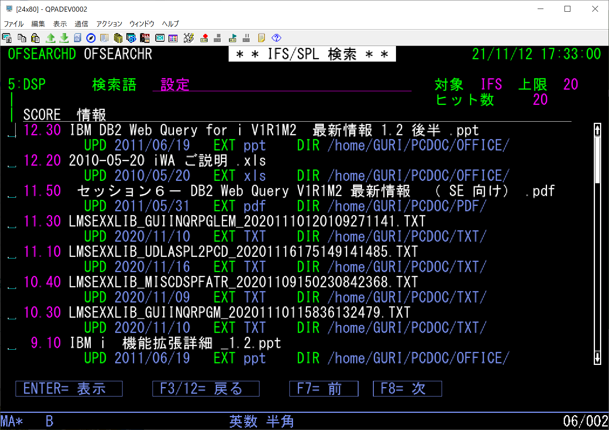
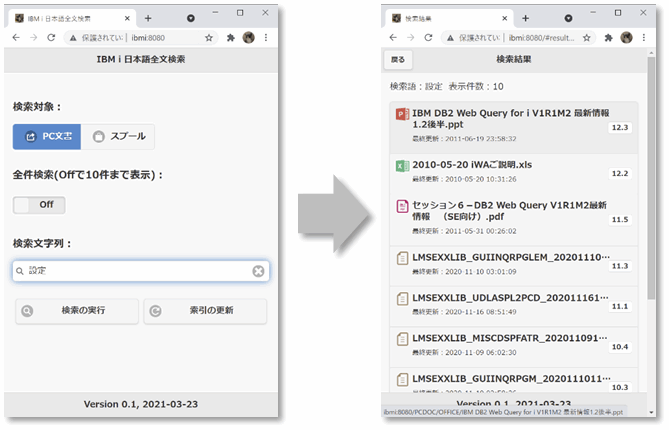

# IBM i で全文検索

「OmniFind Text Search Server for DB2 for i」(以下OmniFind)によるIBM i の拡張検索サンプル。

このサンプルではスプールファイルおよびIFSのPC文書の全文検索を行う。  
※ OmniFindの基本機能はSQLへのCONTAINS/SCOREスカラー関数の拡張。詳細は動画[「IBM i で全文検索」](https://youtu.be/gc19-2nSQHw)を参照。

- 5250画面からスプールファイル、あるいは、IFS上のPC文書(テキスト、XML、HTML、Excel/PowerPoint/Word、PDF、一太郎など)を検索・表示
- 全文検索用のWeb APIを用意し、Webブラウザからスプールファイル、あるいは、IFS上のPC文書を検索・表示

 

**OmniFindの導入・設定は「[OMNIFIND.md](OMNIFIND.md)」を参照。**

**検索アプリケーションのコンパイル／環境設定は「[INSTALL.md](INSTALL.md)」を参照。**

 

---
## 5250画面から検索

RUNSQLコマンドでOmniFindの検索結果をファイルに保管して5250画面に一覧表示。

エンドユーザーの利便性向上のため、ラジオボタン、ブッシュボタン、スクロールバーなど、DDSのGUI機能を採用。  
検索結果のPCファイルを5250画面から開く事が可能。

### 【使用ファイル】  

| MBR/OBJ/FILE名 | タイプ | テキスト/補足 |
---------------|--------|-----------------------------------------| 
| CRTTMPF | CLLE | OmniFind UDTF出力ファイル作成 |
| OFSEARCHD | DSPF | OmniFindを利用したIFS/スプールの全文検索 |
| OFSEARCHR | RPGLE | OmniFindを利用したIFS/スプールの全文検索 |

### 【コンパイル／環境設定】  

「[INSTALL.md](INSTALL.md)」を参照。  

### 【実行】

プログラムOFSEARCHRをCALLで実行。

- 検索語の入力フィールドに検索ワードを入力
- 右上の「IFS」「SPL」で検索対象がPC文書かスプールファイルかをラジオボタンで選択、検索結果の上限に20件または「MAX」(無制限)を選択

- F14/F16でテキスト索引を更新

- 検索結果画面でロールアップ/ダウンキー、スクロールバー、F7/F8などでスクロールし、表示したい項目にカーソルを合わせて実行、または、マウスのダブルクリックで表示
- 検索対象がPC文書の場合はPCで対応したアプリケーションが起動して文書を表示
- 検索対象がスプールファイルの場合は対象のスプールファイルをDSPSPLFで5250画面に表示

***
## Webブラウザから検索

OmniFind検索をREST APIで実装、PCやスマートフォンなどのWebブラウザから利用可能。

実行できる機能は5250版と同様。  
※ 「ファイルを開く」の動作はクライアントやアプリケーションの設定に依存

### 【使用ファイル】  

| MBR/OBJ/FILE名 | タイプ | テキスト/補足 |
---------------|--------|-----------------------------------------| 
| SHIFTUDTF | RPGLE | Pad blank to every shift code to align DBCS string |
| UDTFSPLF | SQL | SQL UDTF to copy DBCS sppoled file |
| OMNIFIND.js | Node.js | RESTで実装したWeb検索アプリケーション |
| index.html | html | Web検索フロントエンド |

### 【コンパイル／環境設定】  

「[INSTALL.md](INSTALL.md)」を参照。  

### 【実行】

Node.jsのWebサーバー(Express)で定義したURLにアクセスして検索。  
操作は5250版とほぼ同様。

***
