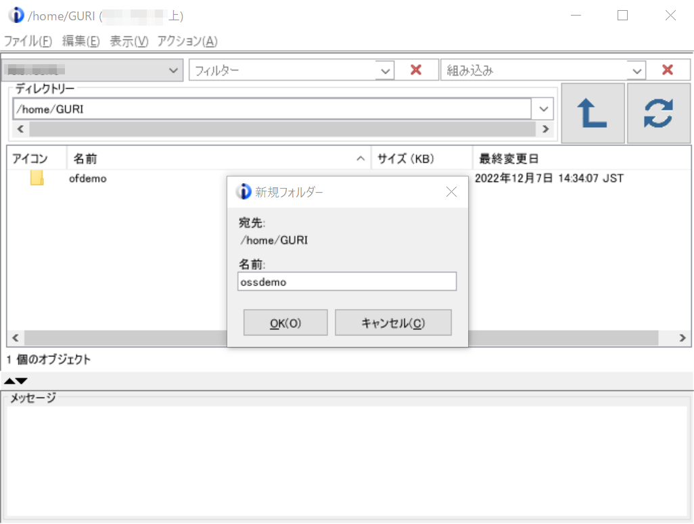
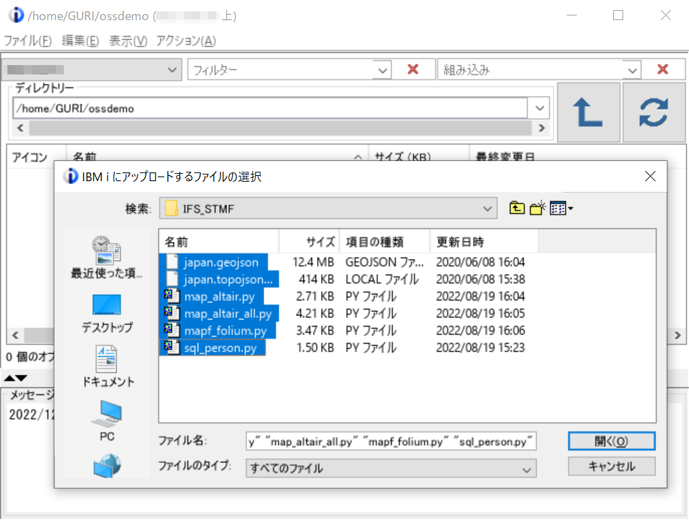

***

## オープンソース活用例 - インストール手順

SAVFをダウンロードしてIBM i に送信、復元。

SAVFの送信は、ACSのIFSプラグインで拡張子「.SAVF」をライブラリー(/QSYS.LIB/ライブラリー名.lib)に直接(事前にSAVFを作成せずに)アップロードする事も可能。  

---

### IBM i で空のSAVFを作成

CRTSAVFコマンドで任意の名前のSAVFを作成。

~~~
> CRTSAVF FILE(QGPL/OSSDEMO)                             
   ライブラリー QGPL にファイル OSSDEMO が作成された。   
~~~

  
### SAVF/STMFのダウンロード(GitHub→PC)

GitHubからSAVFとSTMF(ストリームファイル)をダウンロード。

Webブラウザでリポジトリーの「[IBM-i-samples/OADEMO/ossdemo.savf](ossdemo.savf)」を開くと、右に「download」と表示されるのでこれをクリック。  

同様に、「[IBM-i-samples/OADEMO/IFS_STMF.zip](IFS_STMF.zip)」をダウンロード。

### IBM i のSAVFへ転送

FTPでSAVFをIBM i にput。

~~~
C:\Users\(Windowsのユーザー名)\Desktop>ftp (IBM i のホスト名またはIPアドレス)
(IBM i のホスト名またはIPアドレス) に接続しました。
220-QTCP AT xxx.yyy.CO.JP.
220 CONNECTION WILL CLOSE IF IDLE MORE THAN 5 MINUTES.
501 OPTS UNSUCCESSFUL; SPECIFIED SUBCOMMAND NOT RECOGNIZED.
ユーザー (ibmi:(none)): (IBM i ユーザー名)
331 ENTER PASSWORD.
パスワード: (IBM i パスワード)
230 ZZZZ LOGGED ON.
ftp> bi
200 REPRESENTATION TYPE IS BINARY IMAGE.
ftp> put ossdemo.savf qgpl/ossdemo
200 PORT SUBCOMMAND REQUEST SUCCESSFUL.
150 SENDING FILE TO MEMBER OSSDEMO IN FILE OSSDEMO IN LIBRARY QGPL.
226 FILE TRANSFER COMPLETED SUCCESSFULLY.
ftp: 26928 バイトが送信されました 0.02秒 1346.40KB/秒。
ftp> quit
221 QUIT SUBCOMMAND RECEIVED.
~~~
  

### オブジェクトの復元

任意のライブラリー(この例では「GURILIB」)に転送したSAVFから復元。  
復元後はSAVFを削除可能。

~~~
> RSTOBJ OBJ(OSSDEMO) SAVLIB(DIST) DEV(*SAVF) SAVF(QGPL/OSSDEMO) RSTLIB(GUR
  ILIB)                                                                    
  1 個のオブジェクトを DIST から GURILIB へ復元した。                      
~~~
  
### ストリームファイルの復元

任意のディレクトリー(この例では「~/ossdemo」)を作成し、[IFS_STMF.zip](IFS_STMF.zip)を解凍して下記ファイルをこのディレクトリーにFTP/NetServer/ACSのIFSプラグイン/wgetなどでコピー。  
復元後はZIPファイルを削除可能。

(ACSのIFSプラグインの操作例 - ディレクトリーの作成)  

(ACSのIFSプラグインの操作例 - ファイルのアップロード)  

(ディレクトリーに配置されたファイル)
~~~
bash-5.1$ pwd
/home/GURI/ossdemo
bash-5.1$ ls -la
total 14924
drwxr-sr-x 2 guri 0    12288 Dec 12 14:24 .
drwxr-sr-x 9 guri 0    24576 Dec 12 14:22 ..
-rwxr-xr-x 1 guri 0 13050092 Dec 12 14:24 japan.geojson
-rwxr-xr-x 1 guri 0   424796 Dec 12 14:24 japan.topojson.local
-rwxr-xr-x 1 guri 0     2778 Dec 12 14:24 map_altair.py
-rwxr-xr-x 1 guri 0     4313 Dec 12 14:24 map_altair_all.py
-rwxr-xr-x 1 guri 0     3560 Dec 12 14:24 mapf_folium.py
-rwxr-xr-x 1 guri 0     1543 Dec 12 14:24 sql_person.py
~~~

---

### ソースの編集

実行環境(対象IBM i サーバー)に合わせて下記の要領でソースを編集。  

一時グラフファイルの格納ディレクトリーを作成。  
※ Python実行時に書き込みエラーになる場合は「chmod 777 格納ディレクトリー」などで権限を付与
~~~
bash-5.1$ mkdir /tmp/OSSGRAPH
~~~

#### CLLEプログラム「CLLE4」

実行環境(対象IBM i サーバー)に合わせてプログラムを修正。     

**CCSIDが5026(日本語カタカナ)のソースファイルで不変文字セットの英小文字を入力する場合は下記の環境で実施。**
- 5250エミュレーターのホスト・コード・ページが**939**または**1399**
- SEUでの編集**前**に「CHGJOB CCSID(65535)」を実行  

CLLEプログラム「CLLE4」の環境依存部分を、下記の要領でソースを編集。   

- [3行目](CLLE4.CLLE#L3)の「VALUE(IBMI)」の値をIBM i のホスト名またはIPアドレスに変更
- [5行目](CLLE4.CLLE#L5)の「VALUE('/tmp/OSSGRAPH/')」の値を一時グラフファイルを格納するディレクトリーに変更
- [69行目](CLLE4.CLLE#L69)、[79行目](CLLE4.CLLE#L79)、[89行目](CLLE4.CLLE#L89)、[99行目](CLLE4.CLLE#L99)、の「/home/GURI/ossdemo/」をストリームファイルを配置したディレクトリーに変更
  

それぞれ、CRTDSPF、CRTBNDCLでコンパイル。  
~~~
> CRTDSPF FILE(GURILIB/DSPF4) SRCFILE(GURILIB/OSSDEMO) RSTDSP(*YES) DFRWRT(
  *NO)                                                                     
   ライブラリー GURILIB にファイル DSPF4 が作成された。                    
> CRTBNDCL PGM(GURILIB/CLLE4) SRCFILE(GURILIB/OSSDEMO)
   プログラム CLLE4 がライブラリー GURILIB に作成された。                
~~~

#### Pythonスクリプト

ODBC接続用の「ユーザーID/パスワード」とデータベースPERSONの「ライブラリー名」をスクリプトにハードコードしているので、環境に合わせて修正。

|スクリプト|ユーザーID/パスワード|ライブラリー名|
|-------|-------|----------|
|sql_person.py|[10/11行目](sql_person.py#L10)|[18/20行目](sql_person.py#L18)|
|map_altair.py|[13/14行目](map_altair.py#L13)|[18/19行目](map_altair.py#L18)|
|map_altair_all.py|[12/13行目](map_altair_all.py#L12)|[17/18行目](map_altair_all.py#L17)|
|mapf_folium.py|[9/10行目](mapf_folium.py#L9)|[14/15行目](mapf_folium.py#L14)|

また、ローカルのファイルを参照しているため、mapf_folium.pyの[43行目](mapf_folium.py#L43)を実際のディレクトリー名に修正。

altairは地理情報をインターネット上の https://raw.githubusercontent.com/dataofjapan/land/master/japan.topojson から、foliumはローカルの /home/ユーザー/ossdemo/japan.geojson から取得。地理情報をローカルに置くか、都度インターネットを参照するかは長短あり。例えば、常に最新の情報を参照できるのと、ローカルから安定して高速に参照できるのと、業務上いずれが望ましいかを考慮・検討。  

必要であれば、ZIP内の「japan.topojson.local」をローカルに置き、altairから利用して比較を実施。

---

## オープンソース活用例 - Python実行環境の設定

### Pythonバージョンの確認と設定

Pythonのデフォルトバージョンを確認し、3.6以外の場合は alternatives コマンドで3.6に変更。  

※ 直接Pythonバイナリを指定する場合は不要  
※ alternativesはRed Hat系の拡張で全環境のデフォルトを変更する。開発/テスト/教育などでPythonの仮想環境を複数用意する場合はPython3系標準のvenvを推奨

~~~
bash-5.1$ python --version
Python 3.6.15
bash-5.1$ alternatives --config python
There are 3 choices for the alternative python (providing /QOpenSys/pkgs/bin/python).

  Selection    Path                          Priority   Status
------------------------------------------------------------
  0            /QOpenSys/pkgs/bin/python3.9   309       auto mode
  1            /QOpenSys/pkgs/bin/python2.7   207       manual mode
* 2            /QOpenSys/pkgs/bin/python3.6   306       manual mode
  3            /QOpenSys/pkgs/bin/python3.9   309       manual mode

Press <enter> to keep the current choice[*], or type selection number:
~~~

### Pythonスクリプトで使用するモジュールのインストール

pip3コマンドで[PyPI](https://pypi.org/)からPythonスクリプトで使用するモジュールを取得。  
※ IBM i がインターネットに接続している必要あり

|モジュール|概要|
|-------|-------|
|pyodbc|ODBCデータベースへのアクセスを容易にするオープンソースのPythonモジュール。DB API 2.0仕様を実装|
|pandas|パワフルなPythonデータ分析ツールキット|
|altair|宣言型統計解析ライブラリ|
|altair-saver|チャートを様々な出力形式に保存するためのAltairの拡張機能を提供|
|folium|Pythonでデータを操作し、foliumでLeafletのマップに可視化|

(インストール例)
~~~
bash-5.1$ pwd
/home/GURI/ossdemo
bash-5.1$ pip3 install pyodbc
Requirement already satisfied: pyodbc in /QOpenSys/pkgs/lib/python3.6/site-packages (4.0.27)
WARNING: Running pip as root will break packages and permissions. You should install packages reliably by using venv: https://pip.pypa.io/warnings/venv
bash-5.1$ pip3 install pandas
Requirement already satisfied: pandas in /QOpenSys/pkgs/lib/python3.6/site-packages (0.22.0)
～～～～～～～～～～～～～～～～～～～～～～～～～～～～～～～～～～～～～～～～
Requirement already satisfied: six>=1.5 in /QOpenSys/pkgs/lib/python3.6/site-packages (from python-dateutil>=2->pandas) (1.10.0)
WARNING: Running pip as root will break packages and permissions. You should install packages reliably by using venv: https://pip.pypa.io/warnings/venv
bash-5.1$ pip3 install altair
Collecting altair
  Downloading altair-4.1.0-py3-none-any.whl (727 kB)
     |################################| 727 kB 7.6 MB/s
～～～～～～～～～～～～～～～～～～～～～～～～～～～～～～～～～～～～～～～～
Successfully installed altair-4.1.0 attrs-22.1.0 entrypoints-0.4 importlib-metadata-4.8.3 jsonschema-3.2.0 pyrsistent-0.18.0 six-1.16.0 toolz-0.12.0 typing-extensions-4.1.1 zipp-3.6.0
WARNING: Running pip as root will break packages and permissions. You should install packages reliably by using venv: https://pip.pypa.io/warnings/venv
bash-5.1$ pip3 install altair_saver
Collecting altair_saver
  Downloading altair_saver-0.5.0-py3-none-any.whl (89 kB)
     |################################| 89 kB 3.0 MB/s
～～～～～～～～～～～～～～～～～～～～～～～～～～～～～～～～～～～～～～～～
Installing collected packages: tornado, portpicker, altair-data-server, selenium, altair-viewer, altair-saver
Successfully installed altair-data-server-0.4.1 altair-saver-0.5.0 altair-viewer-0.4.0 portpicker-1.5.2 selenium-3.141.0 tornado-6.1
WARNING: Running pip as root will break packages and permissions. You should install packages reliably by using venv: https://pip.pypa.io/warnings/venv
bash-5.1$ pip3 install folium
Collecting folium
  Downloading folium-0.13.0-py2.py3-none-any.whl (96 kB)
     |################################| 96 kB 848 kB/s
～～～～～～～～～～～～～～～～～～～～～～～～～～～～～～～～～～～～～～～～
Successfully installed branca-0.5.0 certifi-2022.12.7 charset-normalizer-2.0.12 folium-0.13.0 requests-2.27.1 urllib3-1.26.13
WARNING: Running pip as root will break packages and permissions. You should install packages reliably by using venv: https://pip.pypa.io/warnings/venv
~~~

### スクリプトのテスト

sshからPythonスクリプトを呼び出し、一時グラフファイルの格納ディレクトリーにグラフが出力されている事、Webブラウザーで開いてグラフが表示される事を確認。

~~~
bash-5.1$ python /home/GURI/ossdemo/sql_person.py A pastel1 /tmp/OSSGRAPH/altmap.html
~~~
