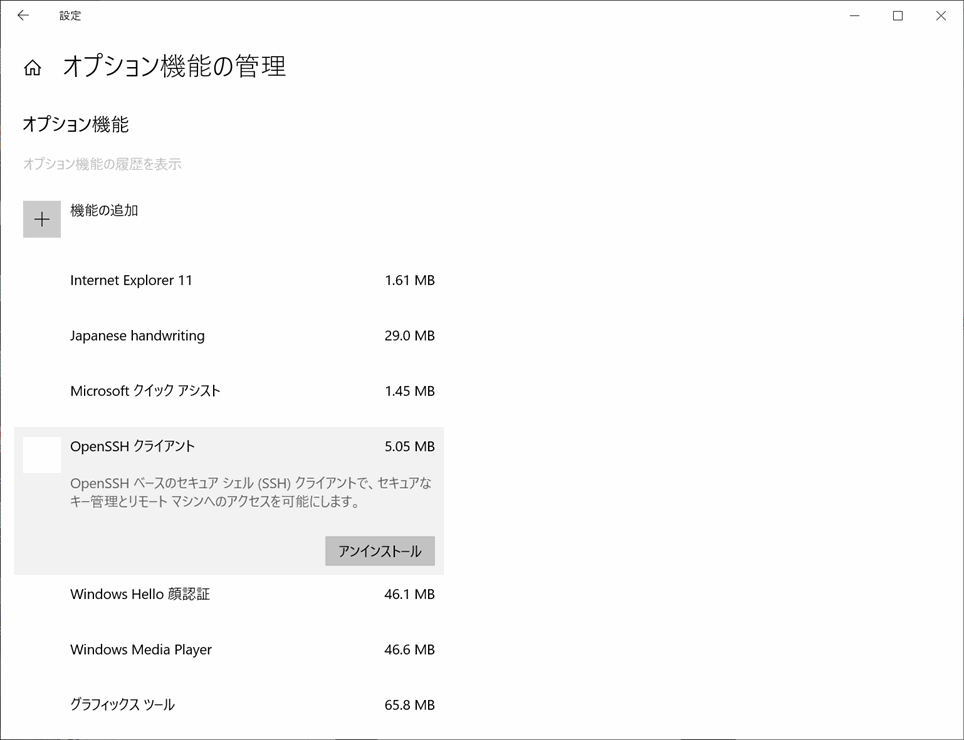

# OSS on IBM i

## IBM i のOSS関連情報 (参考)

IBM i とオープンソース概要は下記IBM資料を参照。

**IBM i とOSS概要**

- [open-source-on-ibmi (英語)](open-source-on-ibmi.pdf)  
- [open-source-on-ibmi (Google翻訳)](open-source-on-ibmi_Google翻訳.pdf)  

**IBM i のOSSに関する情報の中核**

- [IBM i Open Source (英語)](https://ibmi-oss-docs.readthedocs.io/en/latest/README.html)
- [Ryver forum](https://ibmioss.ryver.com/index.html)

**日本語の情報**

2020年の記事で古くなった情報有り。  
例えば[Bitbucket](https://bitbucket.org/ibmi/opensource/src/master/docs/yum/)のサイトはすでに閉鎖。

- [『 yum on IBM i 』による、OSSの活用は、次なるステージへ… ～Open Source協議会 – IBM i 技術分科会～ 2020.03.16](https://www.i-cafe.info/column/product/20200214_oss_2)
- [【できる IBM i 7.4 解剖】第3回「進むIBM i のオープン化とOSSサポート」 2020.07.08](https://www.i-cafe.info/column/serials/dekiruibmi_no3)

---

## OSS環境構築のヒント

ここではステップバイステップの手順は解説せず、情報元と考慮点を記載。  

- [Getting Started (英語)](https://ibmi-oss-docs.readthedocs.io/en/latest/yum/README.html)セクションに初期作業が記載あり。
- ACSの「Open Source Package Management」で使用するユーザーはCCSID 5035または1399を指定して作成、ユーザーIDの長さは8文字まで(POSIX標準の制約)。
- 事前に「STRTCPSVR \*SSHD」を実行しておく。IPL時に自動開始させる方法は[「How to setup the IBM i SSH daemon to autostart with TCP/IP」](https://www.ibm.com/support/pages/how-setup-ibm-i-ssh-daemon-autostart-tcpip)を参照。
- Windows10をsshクライアントで利用する場合、Windows標準のsshクライアントを推奨。 「設定」->「アプリ」->「オプション機能の管理」 から「OpenSSH クライアント」をインストール。
 
  Windows10のオプション機能のインストール画面例  
      
- ssh接続を鍵認証にする場合は[「PowerVS IBM i 日記(5): 【重要】ssh のパスワード認証を停止し鍵認証に移行する」](https://qiita.com/6onoda/items/824d56250345ccd2b8c6)なども参照。
- IBM i が7.3以前ではsshセッションのDBCS(漢字)が文字化けする。IBM i 7.4以降では「export LANG=JA_JP.UTF-8」を実行すれば漢字が正常に表示される。([PASE環境の文字コードのデフォルトがutf-8に変更](https://www.ibm.com/docs/ja/i/7.4?topic=system-default-pase-ccsid-locale-changed-utf-8)された事によると思われる)    

(IBM i 7.3以前)
<pre>
$ system wrksyssts
                                                                                                        1
 5770SS1 V7R3M0  160422                                                                            SA111D    19/08/05  15:42:07 JST
  CPU% . . . . . . . . . . . . . . :            3.3           ASP . . . . . . . . . . . . . :        572.6 G
 CPU%  . . . . . . . :             .3           ASP%  . . . . . . . . . :        10.8808
 . . . . . . . . . . . . . . . :       00:00:01           . . . . . . . . . . . . :        572.6 G
 . . . . . . . . . . :            187           . . . . . . . . . . . . . :         6261 M
 % . . . . . . . . . . . . :           .007           . . . . . . . . . . . . :         6435 M
 % . . . . . . . . . . . . :           .038
                                                                                                                          s
  mw            MAX  -------DB-------  -----DB-----    ACT->   WAIT->    ACT->                          
      b M   b M     ACT       s       s     WAIT    INEL      INEL          mw     e]
    1    1311.33    656.39  +++++       .0       .0       .0       .0     50.9       .0       .0  *MACHINE                *FIXED
    2    3894.06      6.46    359      4.2    122.2      5.9      9.3  11307.3       .0       .0  *BASE                   *CALC
    3      81.18       .00      5       .0       .0       .0       .0       .0       .0       .0  *SPOOL                  *CALC
    4    2832.40       .00    203       .0       .0       .0       .0       .0       .0       .0  *INTERACT               *CALC
                                         * * * * *    * * * * *
$
</pre>

(IBM i 7.4以降)
<pre>
guri@ibmi Bash5.1 ~ $ system wrksyssts
                                               システム状況情報                                                    ページ     1
 5770SS1 V7R5M0  220415                                                                            SA111D    22/10/18  16:02:31 JST
  CPU使用% . . . . . . . . . . . . . . :            3.7           システムASP . . . . . . . . . . . . . :        572.6 G
 上限なしCPU容量使用%  . . . . . . . :             .3           システムASP使用%  . . . . . . . . . :        44.8703
 経過時間. . . . . . . . . . . . . . . :       00:00:01           合計補助記憶域. . . . . . . . . . . . :        572.6 G
 システム内のジョブ. . . . . . . . . . :            891           現行使用一時. . . . . . . . . . . . . :        23101 M
 永久アドレス% . . . . . . . . . . . . :           .013           ピーク使用一時. . . . . . . . . . . . :        23453 M
 一時アドレス% . . . . . . . . . . . . :           .016
                                                                                                                          ﾍﾟｰｼﾞ
  ｼｽﾃﾑ     ﾌﾟｰﾙ   予約済    MAX  -------DB-------  -----非DB-----    ACT->   WAIT->    ACT->                          送り
  ﾌﾟｰﾙ    ｻｲｽﾞ M   ｻｲｽﾞ M     ACT  不在     ﾍﾟｰｼﾞ  不在     ﾍﾟｰｼﾞ     WAIT    INEL      INEL  ﾌﾟｰﾙ        ｻﾌﾞｼｽﾃﾑ     ｵﾌﾟｼｮﾝ
    1    1352.89    693.30  +++++       .0       .0       .0       .0     55.2       .0       .0  *MACHINE                *FIXED
    2    5667.19     11.33  25009       .0       .0       .0       .0  10064.5       .0       .0  *BASE                   *CALC
    3    1017.72       .00    203       .0       .0       .0       .0       .0       .0       .0  *INTERACT               *CALC
    4      81.18       .00      5       .0       .0       .0       .0       .0       .0       .0  *SPOOL                  *CALC
                                         * * * * *  リ　ス　ト　の　終　わ　り  * * * * *
guri@ibmi Bash5.1 ~ $
</pre>

- 必要なパッケージの判別が難しい場合、全てのパッケージのインストールを推奨。IBM i 7.5で2022/10時点で10GB程度のディスク容量を使用。パッケージのインストール先は[「How to Determine where IBM i Open Source Packages are installed」](https://www.ibm.com/support/pages/how-determine-where-ibm-i-open-source-packages-are-installed)を参照
<pre>
guri@ibmi Bash5.1 ~ $ du -m -s /QOpenSys/pkgs/
10483   /QOpenSys/pkgs/
</pre>
- 標準ではOSSへのパスが通っていないので、次のようなシェルスクリプトをユーザー毎に用意すると便利。(「guri」を実際のユーザー名に置き換え)  

【準備】
<pre>
> MKDIR DIR('/home/GURI')
  ディレクトリーが作成された。
> QSH CMD('touch -C 819 /home/GURI/.bashrc')
  コマンドは終了状況0で正常に終了しました。
> QSH CMD('touch -C 819 /home/GURI/.profile')
  コマンドは終了状況0で正常に終了しました。
</pre>

【/home/guri/.profile】
<pre>
exec bash 
</pre>

【/home/guri/.bashrc】
<pre>
export PATH=/QOpenSys/pkgs/bin:$PATH                                                     
export PS1="\[\e[1;35m\]\u@\h \[\e[0;34m\]Bash\v \[\e[0;32m\]\w \[\e[0;33m\]\\$ \[\e[m\]"  <- (オプション)プロンプトの文字列指定、

</pre>

---  

## OSSプログラム開発時の考慮点 (:construction:参考)

### 前提知識

PythonやNode.jsのプログラム(スクリプト)を開発する前提(一部)を下記に示す。

- UNIX(Linux)の基本
  - 概念(プロセス、ファイルシステム、主要設定ファイル、標準入出力、ライセンスなど)
  - 操作(ログイン、シェル、コマンド、パス、環境変数、ファイル操作、パーミッションなど)

- 言語仕様
  - シェルスクリプト(sh、bash)
  - Python(文法、PIP)
  - Node.js(概念、文法、npm)
  - DBアクセス(ODBC)

### OSS一般の考慮点

- OSSのライセンス
  - 拡張機能、ライブラリーなどは個別のライセンスを要確認(商利用の可否など)
  - GPLなどの制約付きライセンスは避ける
  
- 互換性
  - IBM i のような厳格な上位互換性はない。このため最新バージョンに加えて1つ前のバージョンを提供し、使用するバージョンを選択するケースが多い
    - Nodeのバージョン選択例
    <pre>
    guri@ibmi Bash4.4 ~ $ alternatives --config node
    There are 4 choices for the alternative node (providing /QOpenSys/pkgs/bin/node).
    
      Selection    Path                                  Priority   Status
    ------------------------------------------------------------
      0            /QOpenSys/pkgs/lib/nodejs14/bin/node   14        auto mode
    * 1            /QOpenSys/pkgs/lib/nodejs10/bin/node   10        manual mode
      2            /QOpenSys/pkgs/lib/nodejs12/bin/node   12        manual mode
      3            /QOpenSys/pkgs/lib/nodejs14/bin/node   14        manual mode
      4            /QOpenSys/pkgs/lib/nodejs8/bin/node    8         manual mode
    
    Press <enter> to keep the current choice[*], or type selection number: (空Enter)
    guri@ibmi Bash4.4 ~ $ node -v
    v10.23.1
    guri@ibmi Bash4.4 ~ $ npm -v
    6.14.10
    </pre>

  - Node.jsの本番と開発環境
    - Node.jsで開発用と本番用のパッケージを変えるには、npm installで「--save-dev」を指定
  - パーミッション
    - スクリプト実行時に権限エラーが発生する場合は chmod 755 fastcgi.py などで実行権限を付与

- サポート
  - SNSによるコミュニティサポートが基本
 

### IBM i 固有の考慮点

主なIBM提供情報(ほぼ英語)

- [ibmi-oss-resources (Important resources for anyone interested in open source on IBM i)](https://ibm.github.io/ibmi-oss-resources/)
- [Open Source Support for IBM i](https://www.ibm.com/support/pages/open-source-support-ibm-i)
- [IBM i Open Source Chat on Ryver](http://ibm.biz/ibmioss-chat) (must first join at this [link](https://ibmioss.ryver.com/application/signup/members/9tJsXDG7_iSSi1Q))

IBM i 上で動作するOSSアプリケーションを開発する際の考慮点。

- ソース(スクリプトや設定)ファイル
  - ストリームファイルとしてIFSに配置
  - 改行コードはCR+LFではなくLFのみが多い。PC(Windows)のエディターで編集した場合はCR+LFになる事がほとんどのため改行コードの変換が必要
    - IBM i のEDTFコマンドや、tr、sedコマンドなどで改行コードを変換可能
  - 多くの場合にCCSIDの設定が必要。touchコマンドでASCII CCSIDを指定しないとシェルが解釈できないので、819(または1208)を指定  
FTPでPCからIFSに転送したストリームファイルは819になるが、NetServerでPCからIFSにコピーすると942(シフトJIS)になる  
PythonやNode.jsのスクリプトはUTF-8がデフォルトの場合が多いので、CHGATRコマンドで変更
<pre>
> CHGATR OBJ('/QOpenSys/usr/python-scripts/person.py') ATR(*CCSID) VALUE(12
  08)                                                                      
  1オブジェクトの属性が変更された。0オブジェクトは変更されていません。 
</pre>

- OSSパッケージ管理
  - IBM i のPTFと同様のポリシーを策定。「問題が無ければ更新しない」あるいは「定期的に最新にする」を検討
  - まれに「rpmdb open failed」のようなエラーになった時は「$ /QOpenSys/pkgs/bin/rpm --rebuilddb」を試行
  - IBM i 用として提供されているパッケージ以外は非推奨(参照：[Third-party (non-IBM) repositories](https://ibmi-oss-docs.readthedocs.io/en/latest/yum/3RD_PARTY_REPOS.html))
  
