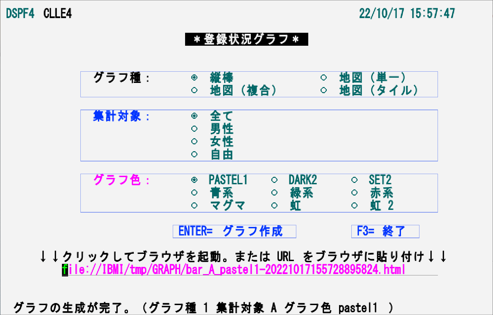
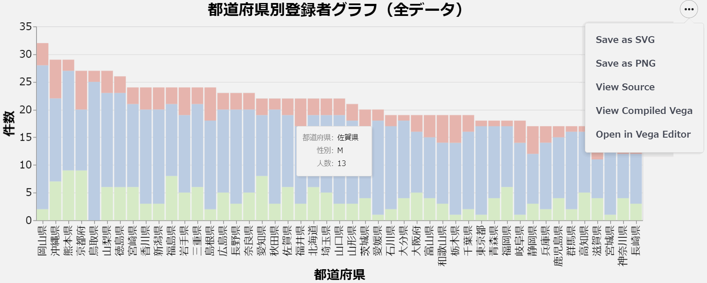
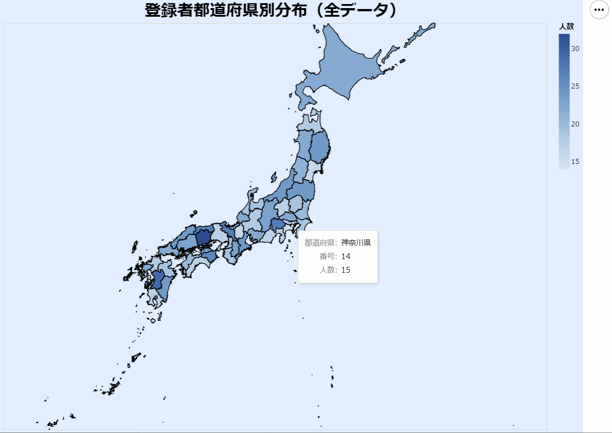
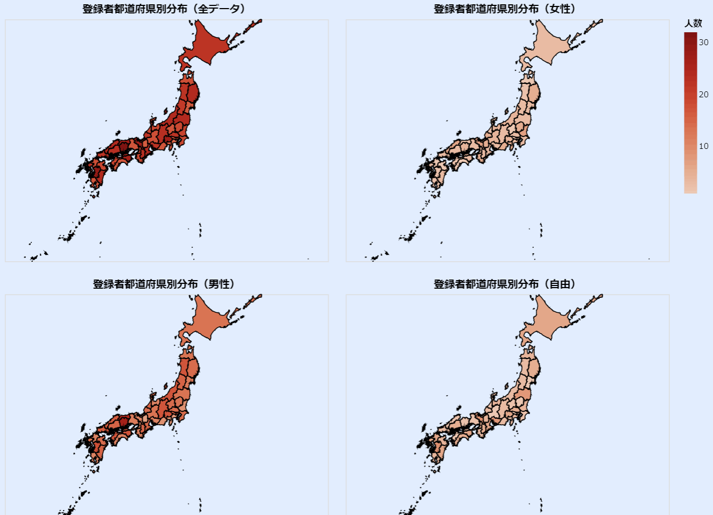
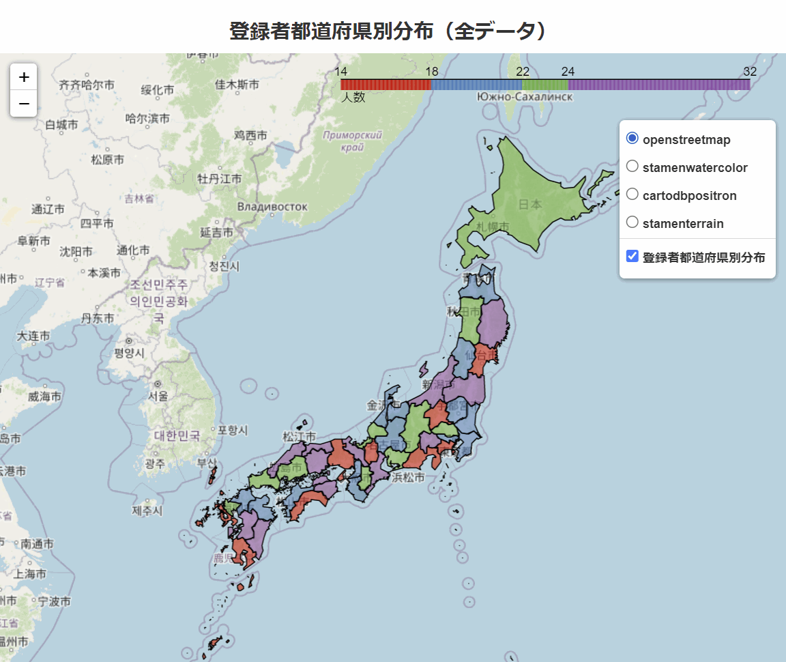

# オープンソース活用例

5250画面(CLプログラム)からIBM i上のPython スクリプトを呼出し、Db2 for iのデータを動的にグラフ化。  
概要は動画「ライト・モダナイゼーション 標準ソフトウェア編」の[「3-2. オープンソース(視覚化例)」](https://youtu.be/vl2u_TjttFg?t=801)を参照

オープンソースソフトウェア(以下OSS)はIBM iにとって非常に重要な要素であり、現在IBM iで利用できるOSSは、質・量ともに過去最高レベルである。主要なOSSの多くがIBM iで稼働し、CLやRPGなどの、既存のアプリケーションとの連携や、ODBCによるDb2 for iへのアクセスも可能。

OSSをクライアントや他のサーバーで動かてIBM iと連携する事も可能であり、IBM iで動かせば、より容易、安全、安定的、かつ効果的なケースもある。

---  

## PythonでDb2 for i のデータをグラフ化

5250画面から条件を指定し、IBM i のPythonを呼び出してDb2 for i のデータを視覚化。

下表のグラフを生成。

|グラフ種|視覚化ライブラリー|付加機能|
---------------|--------|-----------------------------------------| 
|縦棒|[altair-4.1.0](https://altair-viz.github.io/)|マウスオーバーでデータ値を表示。指定の形式(svg、png、html)でグラフを保管|
|地図（単一）|〃|〃|
|地図（複合）|〃|〃|
|地図（タイル）|[Folium](http://python-visualization.github.io/folium/)|地図の拡大・縮小。タイル(地図表現)の切替え|

※ PythonでポピュラーなMatplotlibは*当初*インストールエラーで利用不可(2020年8月に解決済み)

### 【使用ファイル】  

| MBR/OBJ/FILE名 | タイプ | テキスト/補足 |配布形態|
---------------|--------|---------------|---|
| DSPF4 | DSPF | 登録状況グラフCLLE |SAVF|
| CLLE4 | CLLE | 登録状況グラフCLLE |SAVF|
|/tmp/OSSGRAPH|DIR|作業ディレクトリー|-|
|sql_person.py|STMF|Pythonスクリプト - 縦棒グラフ|ZIP|
|map_altair.py|STMF|Pythonスクリプト - 地図（単一）グラフ|ZIP|
|map_altair_all.py|STMF|Pythonスクリプト - 地図（複合）グラフ|ZIP|
|mapf_folium.py|STMF|Pythonスクリプト - 地図（タイル）グラフ|ZIP|
|japan.geojson|STMF|foliumが参照する地理データ|ZIP|

### 【環境設定／インストール／コンパイル】  

[INSTALL.md](INSTALL.md)を参照。

### 【参考：IBM i におけるOSS開発の考慮点】

[OSSSETUP.md](OSSSETUP.md)を参照。

### 【画面例】

5250画面から、「グラフ種」、「集計対象」、「グラフ色」を指定してEnterキーを押す、または「ENTER=グラフ作成」ボタンをクリックすると、指定値に応じてHTMLファイルを生成。このHTMLファイルへのパス(URL)がホットスポットで画面に表示される ので、これをクリックしてWebブラウザにグラフを表示。
URLがカナ化けする場合は文字切替(Ctrl＋F3)を押す。

### 【出力グラフ】

[Altair](https://altair-viz.github.io/)によるシンプルな縦棒グラフ。

日本地図。都道府県ごとに登録者数で色分け

複合グラフ。複数のグラフをまとめて出力。

[Folium](http://python-visualization.github.io/folium/)によるインターアクティブな地図(表示形式変更、拡大・縮小が可能)

---
