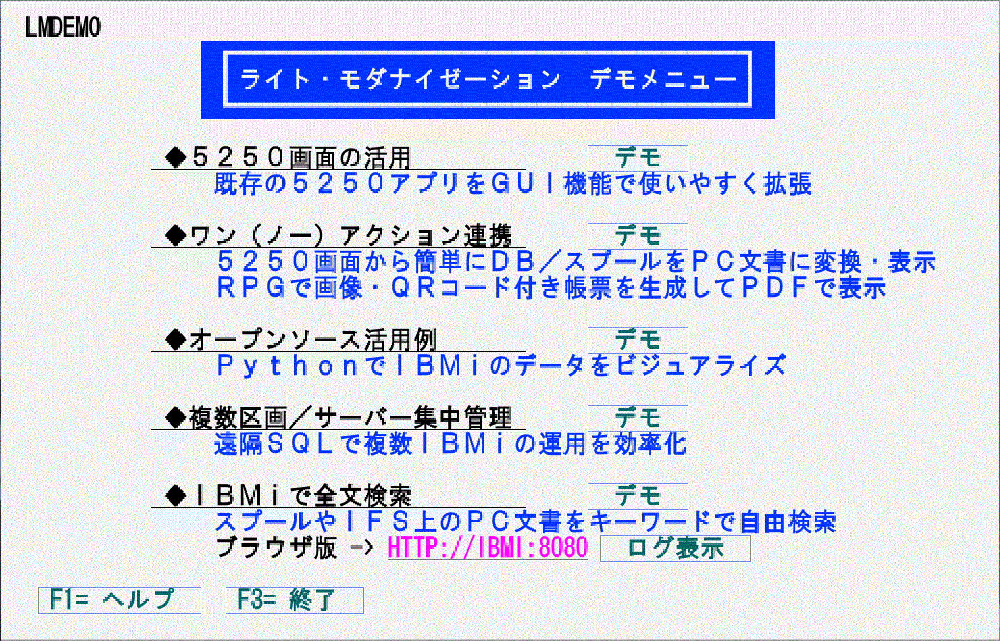

# IBM-i-samples

> [!CAUTION]
> <ul>
> <li>当リポジトリを含めたすべての配布物は一切の保証なく現状のまま配布されるものであり、バグの修正やサポートは提供されません。</li>
> <li>記載された内容の完全な正確性、再現性を保証するものではありません。実施は使用者の責任において判断ください。</li>
> <li>掲載される個々の商標・ロゴマーク、商号に関する権利は、それぞれの権利の所有者に帰属します。</li></ul>

## Overview

IBM i の標準的な機能を利用したサンプルプログラム集です。
業務をモダナイゼーションするヒントになるかもしれません。  
関連する動画を[YouTube](https://www.youtube.com/channel/UCXXqyqBk5spc4L95gJj-OGA/)に投稿しています。

***
## Requirement

IBM i 7.4、7.5で動作を確認、より古いバージョンは未テスト。一部の機能(二次元バーコードなど)はバージョンによって利用不可。

詳細は各カテゴリーの説明を参照。

|カテゴリー|デモ(サンプル)の内容|言語|IBM i バージョン|
|----------|-----------------|----------|----------|
|[サンプルデータ](/demodata)|サンプルで使用しているデータ|DDS(PF/LF), JPEG|全て|
|[5250画面の活用](/LMS5250)|照会画面（非モダナイズ版）|RPG/400|全て|
||照会画面（モダナイズ版）|OPMまたはILE-RPG|V3以降|
||メニュー・バーの例|RPG/400|〃|	
||5250表示属性一覧|CLP|全て|〃|
|[ワン(ノー)アクション連携](/OADEMO)|DB⇒Excel変換＆表示|CMD/CLLE/VBA|V3以降|
||スプール⇒PDF変換＆表示|CLLE/RPG400|6.1以降 ※|
||高品質な帳票生成とPDF化|CLLE/ILE-RPG|7.3以降| 
|[オープンソース活用例](/OSSDEMO)|Db2 for iのデータを棒グラフや日本地図に視覚化|CLLE/Python3.6|〃|
|[複数区画/サーバー集中管理](/IBMISVC)|一括稼働状況表示|SQLRPGLE|〃|
||一括動作時刻表示|SQLRPGLE|〃|
||区画間システム値比較|CLP|〃|
|[IBM iで全文検索](/OFDEMO)|5250画面から検索|ILE-RPG|〃|
||Webブラウザから検索|Node.js/JavaScript|〃|

※ 出口点QIBM_QSP_SPLF_LSTACTが利用できることが前提

***
## Features, Reference

以下の5つカテゴリーでディレクトリーに分けてあります。  
詳しくは各カテゴリーの説明を参照ください。

### ◆5250画面の活用

ディレクトリー [LM5250](/LMS5250)

5250画面のモダナイゼーション(DDS-GUI、132/80桁の両対応、ハイパーリンク、など)

### ◆ワンアクション連携

ディレクトリー [OADEMO](/OADEMO)

WRKSPLFから選択したスプールファイルをTEXT/PDF化  
PDMからPFを選択し、整形済みExcelを表示  
RPG+DDSで、画像・QRコード・罫線・アウトラインフォントを含む高品質PDFを生成

### ◆オープンソース活用

ディレクトリー [OSSDEMO](/OSSDEMO)

CLからPythonを呼び出してDb2 for i のデータをグラフ化(棒グラフ、地図[コロプレスマップ]、複合グラフ)

### ◆複数区画／サーバー集中管理

ディレクトリー [IBMISVC](/IBMISVC)

複数サーバー/区画の状況(CPU使用率、ディスク容量利用率、システム時刻、IPL日時など)を一覧表示

### ◆IBM i で全文検索

ディレクトリー [OFDEMO](/OFDEMO)

IFSのPC文書やスプールファイルを全文検索。5250画面あるいはWeb画面(Node.js利用)から検索

***
## Usage

インストールおよび使用方法は各カテゴリーのドキュメントを参照。

***
## Author

[twitter Guri@GuriCatNyan](https://twitter.com/GuriCatNyan)  
[YouTubeの「ぐりちゃんねる」](https://www.youtube.com/channel/UCXXqyqBk5spc4L95gJj-OGA/)

## Licence

See [LICENSE.md](/LICENSE.md).

[The MIT License](https://opensource.org/licenses/mit-license.php)  
[日本語訳(参考)](https://licenses.opensource.jp/MIT/MIT.html)

***
